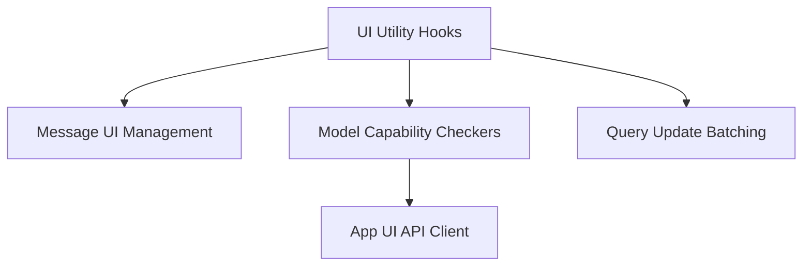

# `ui_utility_hooks` Module Documentation

## Introduction
The `ui_utility_hooks` module provides a collection of reusable React hooks designed to enhance the functionality and user experience of the application's UI. These hooks encapsulate common UI logic, such as automatic scrolling in message displays, checking model capabilities, and optimizing data updates through batching, ensuring a modular and maintainable codebase.

## Architecture
The `ui_utility_hooks` module integrates with various parts of the UI, offering specialized functionalities through its sub-modules. It primarily acts as a central point for UI-related utilities that other components can readily consume.

<!-- DIAGRAM_JSON
{
    "direction": "TD",
    "nodes": [
        {"id": "ui_utility_hooks", "label": "UI Utility Hooks", "type": "module"},
        {"id": "message_handling", "label": "Message UI Management", "type": "module", "link": "message_handling.md"},
        {"id": "model_capabilities", "label": "Model Capability Checkers", "type": "module", "link": "model_capabilities.md"},
        {"id": "query_batching", "label": "Query Update Batching", "type": "module", "link": "query_batching.md"},
        {"id": "app_ui_api_client", "label": "App UI API Client", "type": "external"}
    ],
    "edges": [
        {"source": "ui_utility_hooks", "target": "message_handling"},
        {"source": "ui_utility_hooks", "target": "model_capabilities"},
        {"source": "ui_utility_hooks", "target": "query_batching"},
        {"source": "model_capabilities", "target": "app_ui_api_client"}
    ],
    "groups": []
}
-->

## Sub-modules

### [Message UI Management](message_handling.md)
This sub-module focuses on enhancing user experience in chat interfaces by providing hooks for automatic message scrolling. It intelligently manages scroll positions during message streaming and new message submissions, ensuring the most relevant content is always in view.

### [Model Capability Checkers](model_capabilities.md)
This sub-module offers utility hooks to query and determine the specific capabilities of different models. It allows the UI to dynamically adapt its features based on whether the currently selected model supports functionalities like vision or tool usage, often interacting with the [App UI API Client](app_ui_api_client.md).

### [Query Update Batching](query_batching.md)
Designed for performance optimization, this sub-module provides hooks to batch multiple updates to a query, thereby reducing the frequency of re-renders and potential API calls. This is particularly useful for scenarios with rapid data changes, ensuring a smoother and more efficient UI.
