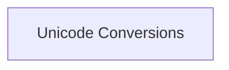

# Unicode Conversion and Flags Module

## Introduction

The `unicode_conversion_and_flags` module is a vital component within the `llama_cpp_unicode` system, responsible for fundamental Unicode string manipulations. It specifically focuses on converting UTF-8 encoded strings into internal code point flags and single-byte representations, which are crucial for subsequent processing within the larger system.

## Architecture Overview

This module is designed with a clear focus on efficient and accurate Unicode data handling. It primarily interfaces with its sub-modules to perform the core conversion tasks, ensuring that character data is correctly interpreted and formatted for the `llama.cpp` library.

<!-- DIAGRAM_JSON
{
    "direction": "TD",
    "nodes": [
        {"id": "unicode_conversions", "label": "Unicode Conversions", "type": "module", "link": "unicode_conversions.md"}
    ],
    "edges": [],
    "groups": []
}
-->

## Module Functionality

The `unicode_conversion_and_flags` module provides the core utilities for: 

- **Unicode Conversions**: Managing the transformation of UTF-8 strings into specific internal formats, including code point flags and single-byte values, as detailed in the [Unicode Conversions](unicode_conversions.md) sub-module.