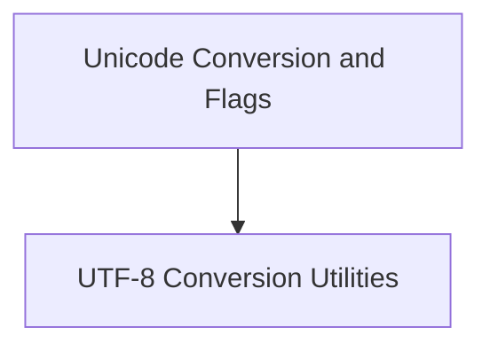

# Unicode Conversions Module

## Introduction
The `unicode_conversions` module is responsible for handling various Unicode conversion operations within the `llama.cpp` project. It provides utilities to convert UTF-8 encoded strings into internal representations, such as character point flags and single bytes, facilitating efficient text processing and manipulation.

## Architecture Overview
The `unicode_conversions` module is a sub-module of `unicode_conversion_and_flags`, which itself is part of the larger `llama_cpp_unicode` module. Its primary responsibility is to encapsulate specific UTF-8 conversion logic. It interacts with other parts of the system by providing fundamental Unicode conversion primitives.

<!-- DIAGRAM_JSON
{
    "direction": "TD",
    "nodes": [
        {"id": "unicode_conversion_and_flags", "label": "Unicode Conversion and Flags", "type": "module", "link": "unicode_conversion_and_flags.md"},
        {"id": "utf8_utilities", "label": "UTF-8 Conversion Utilities", "type": "module", "link": "utf8_utilities.md"}
    ],
    "edges": [
        {"source": "unicode_conversion_and_flags", "target": "utf8_utilities"}
    ],
    "groups": []
}
-->

## Sub-modules

### [UTF-8 Conversion Utilities](utf8_utilities.md)
This sub-module contains core functionalities for converting UTF-8 encoded strings. It provides functions to derive character point flags and convert UTF-8 strings to single-byte representations. These utilities are crucial for the internal handling and processing of textual data.
