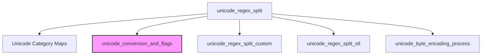

# unicode_regex_processing Module Documentation

## Introduction

The `unicode_regex_processing` module, part of the `llama_cpp_unicode` family, provides robust functionality for splitting Unicode text based on regular expressions. Its primary component, `unicode_regex_split`, is designed to handle the complexities of Unicode characters and categories efficiently, integrating a "collapsed" representation strategy to optimize regex matching.

## Purpose and Core Functionality

The core purpose of this module is to enable precise text segmentation in applications that deal with diverse linguistic data. The `unicode_regex_split` function is central to this, offering:
*   **Unicode Category Recognition**: It understands and processes standard Unicode character categories (e.g., `\p{N}` for Numbers, `\p{L}` for Letters, `\p{P}` for Punctuation, `\p{M}` for Accent Marks, `\p{S}` for Symbols).
*   **Collapsed Text Representation**: For regexes involving Unicode categories, it generates a single-byte "collapsed" version of the input text. This simplifies the regex matching process by mapping various Unicode codepoints to a limited set of single-byte representations, making `std::regex` more efficient.
*   **Flexible Splitting**: It first attempts to use an optimized custom regex splitting mechanism (`unicode_regex_split_custom`) and falls back to standard C++ regular expressions (`std::regex` or `std::wregex` via `unicode_regex_split_stl`) if a custom implementation is not available or suitable.
*   **UTF-8 and Wide String Handling**: It seamlessly converts between UTF-8 encoded strings and Unicode codepoint vectors (`std::vector<uint32_t>`) or wide strings (`std::wstring`) as required for processing.

This functionality is critical for tasks such as tokenization, natural language processing, and any operation requiring precise text partitioning in a multilingual context.

## Architecture and Component Relationships

The `unicode_regex_processing` module primarily revolves around the `unicode_regex_split` function and its internal helpers and data structures. It interacts with the `unicode_conversion_and_flags` module for fundamental Unicode character operations.

<!-- DIAGRAM_JSON
{
    "direction": "TD",
    "nodes": [
        {"id": "unicode_regex_split", "label": "unicode_regex_split", "type": "component", "link": null},
        {"id": "k_ucat_maps", "label": "Unicode Category Maps", "type": "component", "link": null},
        {"id": "unicode_regex_split_custom", "label": "unicode_regex_split_custom", "type": "component", "link": null},
        {"id": "unicode_regex_split_stl", "label": "unicode_regex_split_stl", "type": "component", "link": null},
        {"id": "unicode_byte_encoding_process", "label": "unicode_byte_encoding_process", "type": "component", "link": null},
        {"id": "unicode_conversion_and_flags", "label": "unicode_conversion_and_flags", "type": "external", "link": "unicode_conversion_and_flags.md"}
    ],
    "edges": [
        {"source": "unicode_regex_split", "target": "k_ucat_maps"},
        {"source": "unicode_regex_split", "target": "unicode_conversion_and_flags"},
        {"source": "unicode_regex_split", "target": "unicode_regex_split_custom"},
        {"source": "unicode_regex_split", "target": "unicode_regex_split_stl"},
        {"source": "unicode_regex_split", "target": "unicode_byte_encoding_process"}
    ],
    "groups": []
}
-->

### Component Breakdown:

*   **`unicode_regex_split(const std::string & text, const std::vector<std::string> & regex_exprs)`**: The main function. It orchestrates the entire splitting process, from determining the need for collapsed text representation to applying regexes and re-encoding results.
    *   **Unicode Category Maps (`k_ucat_enum`, `k_ucat_cpt`, `k_ucat_map`)**: Static constant maps used internally by `unicode_regex_split` to define and translate Unicode categories into a single-byte collapsed representation.
    *   **`unicode_regex_split_custom`**: An internal helper function that attempts to perform regex splitting using a specialized, potentially more efficient, custom implementation.
    *   **`unicode_regex_split_stl`**: An internal helper function that performs regex splitting using the standard C++ `std::regex` or `std::wregex` library, acting as a fallback for `unicode_regex_split_custom`.
    *   **`unicode_byte_encoding_process`**: A final processing step applied to the `bpe_words` vector, likely for further byte encoding refinements.

### External Dependencies:

*   **`unicode_conversion_and_flags`**: This module is crucial for handling fundamental Unicode character operations. `unicode_regex_split` relies on functions from this module for:
    *   Converting UTF-8 strings to codepoint vectors (`unicode_cpts_from_utf8`).
    *   Extracting Unicode character properties and flags from codepoints (`unicode_cpt_flags_from_cpt`).
    *   Converting UTF-8 strings to wide strings (`unicode_wstring_from_utf8`).
    *   Converting codepoints back to UTF-8 (`unicode_cpt_to_utf8`).
    For detailed information, refer to the [unicode_conversion_and_flags.md](unicode_conversion_and_flags.md) documentation.

## How the Module Fits into the Overall System

The `unicode_regex_processing` module is a fundamental part of the `llama_cpp_unicode` module, which itself is a sub-module of `llama_cpp`. In the broader `llama.cpp` ecosystem, accurate and efficient Unicode text processing is paramount for tasks such as:
*   **Tokenization**: Breaking down input text into individual tokens for language models. The precise splitting enabled by this module ensures that tokens are correctly identified across various languages and character sets.
*   **Text Preprocessing**: Preparing text data for various NLP tasks by handling character boundaries, punctuation, and other linguistic features in a Unicode-aware manner.
*   **Grammar-based Generation**: Potentially used in conjunction with grammar processing modules (like `llama_cpp_grammar` or `json_schema_grammar`) to ensure that generated text adheres to specified Unicode-aware patterns.

By providing specialized Unicode regex splitting capabilities, this module contributes to the overall robustness and multilingual support of the `llama.cpp` project, ensuring consistent and correct text handling for advanced language model operations.
