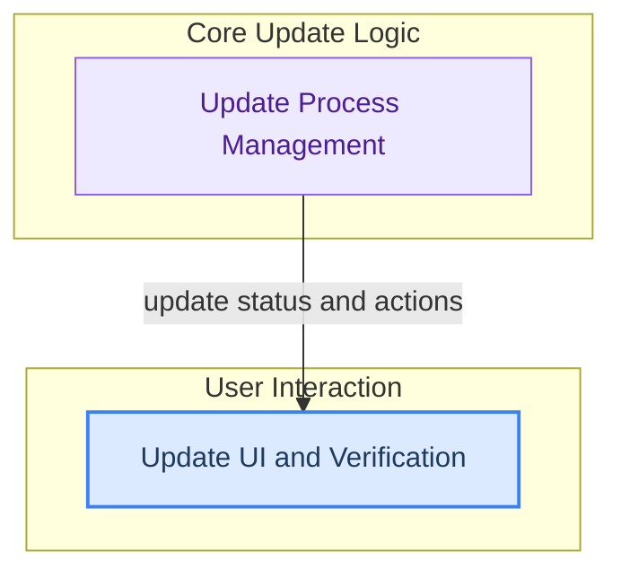

# Application Update System
This module oversees the complete lifecycle of application updates, including background checks, download management, integrity verification, and integration with user interface elements for update notifications and control.
<!-- DIAGRAM_JSON
{
    "direction": "TD",
    "nodes": [
        {"id": "update_process_management", "label": "Update Process Management", "type": "module", "link": "update_process_management.md"},
        {"id": "update_ui_and_verification", "label": "Update UI and Verification", "type": "module", "link": "update_ui_and_verification.md"}
    ],
    "edges": [
        {"source": "update_process_management", "target": "update_ui_and_verification", "label": "update status and actions"}
    ],
    "groups": [
        {"id": "core_update_logic", "label": "Core Update Logic", "role": "analytical", "nodes": ["update_process_management"]},
        {"id": "user_interaction", "label": "User Interaction", "role": "surface", "nodes": ["update_ui_and_verification"]}
    ]
}
-->
