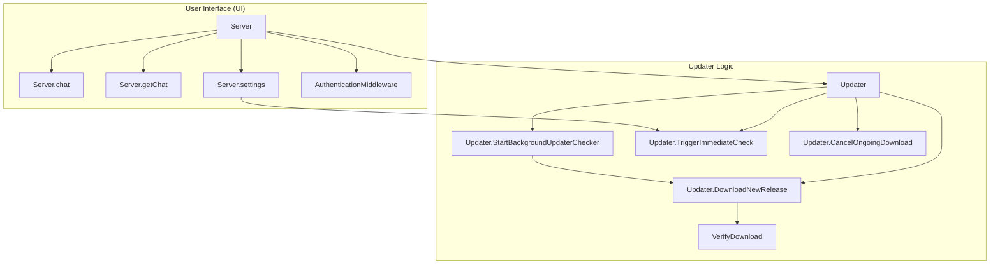

# user_interface_and_updates
This module manages the user interface interactions and handles automatic software updates. It includes core server functionalities for chat and settings, along with a robust update mechanism for checking, downloading, and verifying new releases.

<!-- DIAGRAM_JSON
{
  "nodes": [
    {"id": "S", "label": "Server"},
    {"id": "SC", "label": "Server.chat"},
    {"id": "SG", "label": "Server.getChat"},
    {"id": "SS", "label": "Server.settings"},
    {"id": "AM", "label": "AuthenticationMiddleware"},
    {"id": "U", "label": "Updater"},
    {"id": "USBC", "label": "Updater.StartBackgroundUpdaterChecker"},
    {"id": "UTIC", "label": "Updater.TriggerImmediateCheck"},
    {"id": "UDNR", "label": "Updater.DownloadNewRelease"},
    {"id": "UCOD", "label": "Updater.CancelOngoingDownload"},
    {"id": "VD", "label": "VerifyDownload"}
  ],
  "edges": [
    {"source": "S", "target": "SC"},
    {"source": "S", "target": "SG"},
    {"source": "S", "target": "SS"},
    {"source": "S", "target": "AM"},
    {"source": "U", "target": "USBC"},
    {"source": "U", "target": "UTIC"},
    {"source": "U", "target": "UDNR"},
    {"source": "U", "target": "UCOD"},
    {"source": "USBC", "target": "UDNR"},
    {"source": "UDNR", "target": "VD"},
    {"source": "SS", "target": "UTIC"},
    {"source": "S", "target": "U"}
  ],
  "groups": [
    {"id": "UI", "label": "User Interface (UI)", "nodes": ["S", "SC", "SG", "SS", "AM"]},
    {"id": "Updater", "label": "Updater Logic", "nodes": ["U", "USBC", "UTIC", "UDNR", "UCOD", "VD"]}
  ]
}
-->
