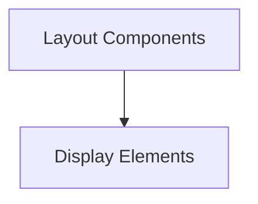

# Utility UI Components

## Introduction

The `utility_ui_components` module provides a collection of reusable UI components designed to enhance user experience within the application. These components cover various aspects, including visual feedback for ongoing operations and structural elements for screen layouts.

## Architecture Overview

This module is composed of several key sub-modules, each focusing on a specific area of UI functionality. The `display_elements` sub-module handles visual feedback like download progress and image rendering, while the `layout_components` sub-module defines structural elements for the application interface.

<!-- DIAGRAM_JSON
{
    "direction": "TD",
    "nodes": [
        {"id": "display_elements", "label": "Display Elements", "type": "module", "link": "display_elements.md"},
        {"id": "layout_components", "label": "Layout Components", "type": "module", "link": "layout_components.md"}
    ],
    "edges": [
        {"source": "layout_components", "target": "display_elements"}
    ],
    "groups": []
}
-->

## Sub-modules

*   **[Display Elements](display_elements.md)**: This sub-module provides components for visual feedback and content display, such as showing download progress and rendering image thumbnails.

*   **[Layout Components](layout_components.md)**: This sub-module contains components responsible for the overall structure and arrangement of UI elements, including sidebar layouts.