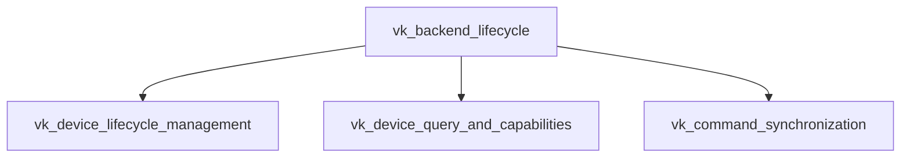

The `vk_backend_lifecycle` module is a critical component within the GGML Vulkan backend, responsible for managing the lifecycle, querying capabilities, and handling synchronization of Vulkan devices. It provides the foundational functions for initializing and terminating Vulkan devices, retrieving their properties, checking supported operations, and ensuring proper command synchronization for efficient GPU computation.

### Architecture

### Core Components Documentation

The `vk_backend_lifecycle` module is composed of the following key sub-modules and their respective components:

#### 1. `vk_device_lifecycle_management`
This sub-module handles the initialization and termination of Vulkan devices.
- `ml.backend.ggml.ggml.src.ggml-vulkan.ggml-vulkan.ggml_backend_vk_device_init`
- `ml.backend.ggml.ggml.src.ggml-vulkan.ggml-vulkan.ggml_backend_vk_free`

#### 2. `vk_device_query_and_capabilities`
This sub-module provides functions to query device properties, count available devices, and check support for specific operations.
- `ml.backend.ggml.ggml.src.ggml-vulkan.ggml-vulkan.ggml_backend_vk_reg_get_device`
- `ml.backend.ggml.ggml.src.ggml-vulkan.ggml-vulkan.ggml_backend_vk_reg_get_device_count`
- `ml.backend.ggml.ggml.src.ggml-vulkan.ggml-vulkan.ggml_backend_vk_device_get_props`
- `ml.backend.ggml.ggml.src.ggml-vulkan.ggml-vulkan.ggml_backend_vk_device_supports_op`

#### 3. `vk_command_synchronization`
This sub-module manages synchronization primitives and operations for Vulkan commands.
- `ml.backend.ggml.ggml.src.ggml-vulkan.ggml-vulkan.ggml_backend_vk_synchronize`
- `ml.backend.ggml.ggml.src.ggml-vulkan.ggml-vulkan.ggml_vk_wait_events`