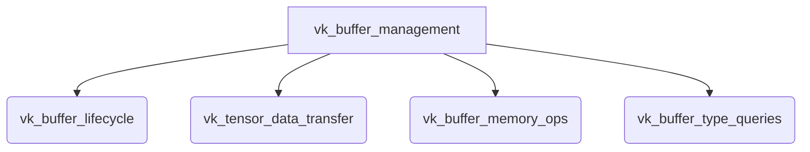

The `vk_buffer_management` module is a critical component within the GGML Vulkan backend, designed for comprehensive and efficient management of Vulkan device and host buffers. Its primary purpose is to abstract the complexities of Vulkan memory operations, providing a robust API for allocating, deallocating, and manipulating buffer data. This includes functionalities for synchronous and asynchronous tensor data transfers (copying, setting, and retrieving), as well as memory initialization operations like clearing and setting specific regions. By centralizing buffer management, the module ensures optimized memory usage and high-performance data handling for GPU-accelerated machine learning workloads.

## Architecture

## Core Components Documentation

### vk_buffer_lifecycle
This sub-module manages the allocation and deallocation of Vulkan buffers, including both device and host-visible memory.
- [`ggml_backend_vk_buffer_type_alloc_buffer`](ml.backend.ggml.ggml.src.ggml-vulkan.ggml-vulkan.ggml_backend_vk_buffer_type_alloc_buffer.md): Allocates a new Vulkan buffer of a specified type.
- [`ggml_backend_vk_buffer_free_buffer`](ml.backend.ggml.ggml.src.ggml-vulkan.ggml-vulkan.ggml_backend_vk_buffer_free_buffer.md): Frees a Vulkan buffer.
- [`ggml_backend_vk_host_buffer_free_buffer`](ml.backend.ggml.ggml.src.ggml-vulkan.ggml-vulkan.ggml_backend_vk_host_buffer_free_buffer.md): Frees a host-visible Vulkan buffer.

### vk_tensor_data_transfer
This sub-module provides functionalities for transferring tensor data between host and device, supporting both synchronous and asynchronous operations.
- [`ggml_backend_vk_buffer_cpy_tensor`](ml.backend.ggml.ggml.src.ggml-vulkan.ggml-vulkan.ggml_backend_vk_buffer_cpy_tensor.md): Copies data between Vulkan buffers.
- [`ggml_backend_vk_cpy_tensor_async`](ml.backend.ggml.ggml.src.ggml-vulkan.ggml-vulkan.ggml_backend_vk_cpy_tensor_async.md): Asynchronously copies data between Vulkan buffers.
- [`ggml_backend_vk_buffer_set_tensor`](ml.backend.ggml.ggml.src.ggml-vulkan.ggml-vulkan.ggml_backend_vk_buffer_set_tensor.md): Sets tensor data in a Vulkan buffer.
- [`ggml_backend_vk_set_tensor_async`](ml.backend.ggml.ggml.src.ggml-vulkan.ggml-vulkan.ggml_backend_vk_set_tensor_async.md): Asynchronously sets tensor data in a Vulkan buffer.
- [`ggml_backend_vk_buffer_get_tensor`](ml.backend.ggml.ggml.src.ggml-vulkan.ggml-vulkan.ggml_backend_vk_buffer_get_tensor.md): Gets tensor data from a Vulkan buffer.
- [`ggml_backend_vk_get_tensor_async`](ml.backend.ggml.ggml.src.ggml-vulkan.ggml-vulkan.ggml_backend_vk_get_tensor_async.md): Asynchronously gets tensor data from a Vulkan buffer.
- [`ggml_vk_buffer_write_nc_async`](ml.backend.ggml.ggml.src.ggml-vulkan.ggml-vulkan.ggml_vk_buffer_write_nc_async.md): Asynchronously writes non-contiguous data to a Vulkan buffer.

### vk_buffer_memory_ops
This sub-module handles basic memory operations on Vulkan buffers, such as clearing and setting memory regions.
- [`ggml_backend_vk_buffer_memset_tensor`](ml.backend.ggml.ggml.src.ggml-vulkan.ggml-vulkan.ggml_backend_vk_buffer_memset_tensor.md): Sets a memory region of a tensor in a Vulkan buffer to a specific value.
- [`ggml_backend_vk_buffer_clear`](ml.backend.ggml.ggml.src.ggml-vulkan.ggml-vulkan.ggml_backend_vk_buffer_clear.md): Clears a Vulkan buffer.

### vk_buffer_type_queries
This sub-module provides utilities for querying the types of buffers supported by a Vulkan device.
- [`ggml_backend_vk_device_get_buffer_type`](ml.backend.ggml.ggml.src.ggml-vulkan.ggml-vulkan.ggml_backend_vk_device_get_buffer_type.md): Retrieves the default buffer type for a Vulkan device.
- [`ggml_backend_vk_device_get_host_buffer_type`](ml.backend.ggml.ggml.src.ggml-vulkan.ggml-vulkan.ggml_backend_vk_device_get_host_buffer_type.md): Retrieves the host-visible buffer type for a Vulkan device.