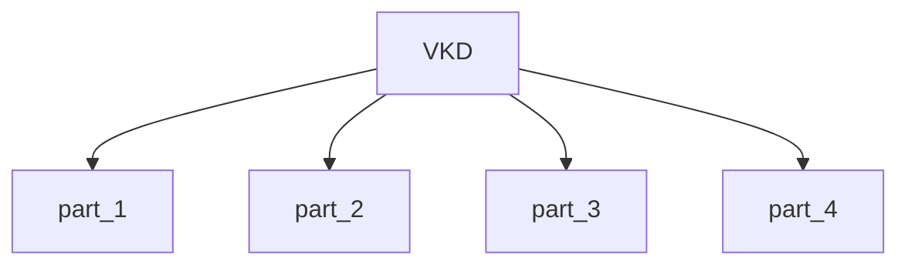

# Vk Device Query And Capabilities

This module contains 4 sub-modules:

- [part_1](part_1.md) - 1 components
- [part_2](part_2.md) - 1 components
- [part_3](part_3.md) - 1 components
- [part_4](part_4.md) - 1 components

## Architecture

