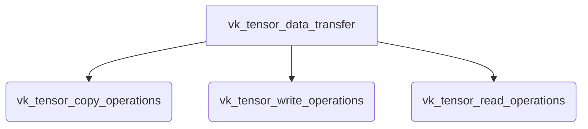

The `vk_tensor_data_transfer` module is a critical component within the GGML Vulkan backend, responsible for managing the efficient transfer of tensor data between host memory and Vulkan device buffers. It provides a set of functions for copying, writing, and reading tensor data, supporting both synchronous and asynchronous operations to optimize performance in GPU-accelerated machine learning workloads.

## Architecture

## Core Components Documentation

### vk_tensor_copy_operations
This sub-module handles the copying of tensor data between Vulkan buffers.
- [`ggml_backend_vk_buffer_cpy_tensor`](ml.backend.ggml.ggml.src.ggml-vulkan.ggml-vulkan.ggml_backend_vk_buffer_cpy_tensor.md)
- [`ggml_backend_vk_cpy_tensor_async`](ml.backend.ggml.ggml.src.ggml-vulkan.ggml-vulkan.ggml_backend_vk_cpy_tensor_async.md)

### vk_tensor_write_operations
This sub-module provides functionalities for writing (setting) tensor data into Vulkan buffers.
- [`ggml_backend_vk_buffer_set_tensor`](ml.backend.ggml.ggml.src.ggml-vulkan.ggml-vulkan.ggml_backend_vk_buffer_set_tensor.md)
- [`ggml_backend_vk_set_tensor_async`](ml.backend.ggml.ggml.src.ggml-vulkan.ggml-vulkan.ggml_backend_vk_set_tensor_async.md)
- [`ggml_vk_buffer_write_nc_async`](ml.backend.ggml.ggml.src.ggml-vulkan.ggml-vulkan.ggml_vk_buffer_write_nc_async.md)

### vk_tensor_read_operations
This sub-module offers methods for reading (getting) tensor data from Vulkan buffers.
- [`ggml_backend_vk_buffer_get_tensor`](ml.backend.ggml.ggml.src.ggml-vulkan.ggml-vulkan.ggml_backend_vk_buffer_get_tensor.md)
- [`ggml_backend_vk_get_tensor_async`](ml.backend.ggml.ggml.src.ggml-vulkan.ggml-vulkan.ggml_backend_vk_get_tensor_async.md)