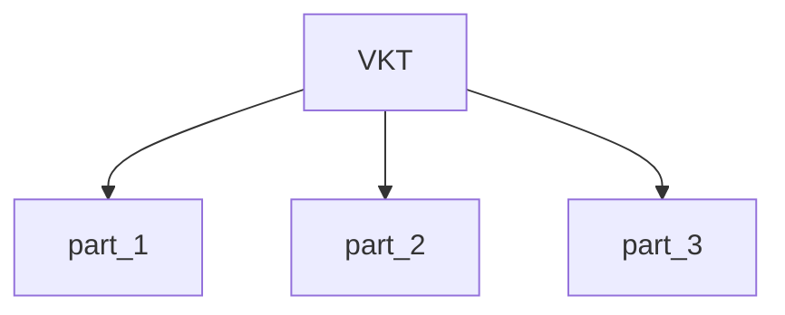

# Vk Tensor Write Operations

This module contains 3 sub-modules:

- [part_1](part_1.md) - 1 components
- [part_2](part_2.md) - 1 components
- [part_3](part_3.md) - 1 components

## Architecture

```mermaid
graph TD
    VKT --> A[part_1]
    VKT --> B[part_2]
    VKT --> C[part_3]
```
