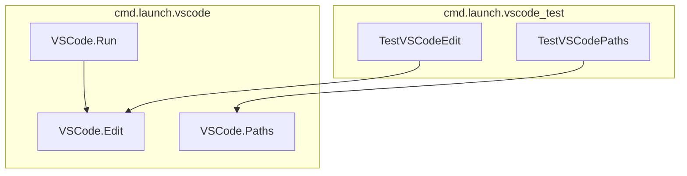

# vscode_integration
This module manages the integration of models with VS Code's Copilot Chat, handling configuration updates, version checks, and model registration. It ensures models are properly exposed and accessible within the VS Code environment.

<!-- DIAGRAM_JSON
{
  "nodes": [
    {
      "id": "A",
      "label": "VSCode.Run",
      "group": "cmd.launch.vscode"
    },
    {
      "id": "B",
      "label": "VSCode.Edit",
      "group": "cmd.launch.vscode"
    },
    {
      "id": "C",
      "label": "VSCode.Paths",
      "group": "cmd.launch.vscode"
    },
    {
      "id": "D",
      "label": "TestVSCodeEdit",
      "group": "cmd.launch.vscode_test"
    },
    {
      "id": "E",
      "label": "TestVSCodePaths",
      "group": "cmd.launch.vscode_test"
    }
  ],
  "edges": [
    {
      "source": "A",
      "target": "B",
      "label": "calls/updates"
    },
    {
      "source": "D",
      "target": "B",
      "label": "tests"
    },
    {
      "source": "E",
      "target": "C",
      "label": "tests"
    }
  ],
  "groups": [
    {
      "id": "cmd.launch.vscode",
      "label": "cmd.launch.vscode"
    },
    {
      "id": "cmd.launch.vscode_test",
      "label": "cmd.launch.vscode_test"
    }
  ]
}
-->
