# web_search_orchestration
This module orchestrates web search functionality, integrating it into the Anthropic API middleware to handle tool calls for dynamic information retrieval and multi-turn interactions.

<!-- DIAGRAM_JSON
{
  "nodes": [
    {"id": "WS", "label": "anthropic.WebSearch"},
    {"id": "WSAW", "label": "middleware.WebSearchAnthropicWriter"},
    {"id": "WSAW_Write", "label": "middleware.WebSearchAnthropicWriter.Write"},
    {"id": "FWS_ToolCall", "label": "middleware.findWebSearchToolCall"},
    {"id": "Rec_Usage", "label": "middleware.recordObservedUsage"},
    {"id": "Run_WSLoop", "label": "middleware.runWebSearchLoop"},
    {"id": "Write_LoopRes", "label": "middleware.writeLoopResult"},
    {"id": "Write_TermResp", "label": "middleware.writeTerminalResponse"},
    {"id": "Start_LoopWorker", "label": "middleware.startLoopWorker"},
    {"id": "Write_Passthrough", "label": "middleware.writePassthroughStreamChunk"},
    {"id": "Write_Resp", "label": "middleware.writeResponse"},
    {"id": "Send_Error", "label": "middleware.sendError"},
    {"id": "Test_CloudGating", "label": "TestWebSearchCloudModelGating"},
    {"id": "Test_MultiLoop", "label": "TestWebSearchMultiIterationLoop"},
    {"id": "Test_StreamTakeover", "label": "TestWebSearchStreamingImmediateTakeover"},
    {"id": "Test_StreamToolCall", "label": "TestWebSearchToolPresent_ModelCallsIt_Streaming"},
    {"id": "Test_NonStreamToolCall", "label": "TestWebSearchToolPresent_ModelCallsIt_NonStreaming"}
  ],
  "edges": [
    {"source": "WSAW_Write", "target": "FWS_ToolCall", "label": "calls"},
    {"source": "WSAW_Write", "target": "Rec_Usage", "label": "calls"},
    {"source": "WSAW_Write", "target": "Write_LoopRes", "label": "calls"},
    {"source": "WSAW_Write", "target": "Write_Passthrough", "label": "calls"},
    {"source": "WSAW_Write", "target": "Write_Resp", "label": "calls"},
    {"source": "WSAW_Write", "target": "Start_LoopWorker", "label": "calls"},
    {"source": "WSAW_Write", "target": "Run_WSLoop", "label": "calls"},
    {"source": "WSAW_Write", "target": "Send_Error", "label": "calls"},
    {"source": "WSAW_Write", "target": "Write_TermResp", "label": "calls"},
    {"source": "Run_WSLoop", "target": "WS", "label": "uses"},
    {"source": "Test_CloudGating", "target": "WSAW_Write", "label": "tests"},
    {"source": "Test_MultiLoop", "target": "WSAW_Write", "label": "tests"},
    {"source": "Test_StreamTakeover", "target": "WSAW_Write", "label": "tests"},
    {"source": "Test_StreamToolCall", "target": "WSAW_Write", "label": "tests"},
    {"source": "Test_NonStreamToolCall", "target": "WSAW_Write", "label": "tests"},
    {"source": "Test_CloudGating", "target": "WS", "label": "mocks"},
    {"source": "Test_MultiLoop", "target": "WS", "label": "mocks"},
    {"source": "Test_StreamTakeover", "target": "WS", "label": "mocks"},
    {"source": "Test_StreamToolCall", "target": "WS", "label": "mocks"},
    {"source": "Test_NonStreamToolCall", "target": "WS", "label": "mocks"}
  ],
  "groups": [
    {"id": "grp_ws_core", "label": "Web Search Core", "nodes": ["WS"]},
    {"id": "grp_middleware", "label": "Anthropic Middleware", "nodes": ["WSAW", "WSAW_Write", "FWS_ToolCall", "Rec_Usage", "Run_WSLoop", "Write_LoopRes", "Write_TermResp", "Start_LoopWorker", "Write_Passthrough", "Write_Resp", "Send_Error"]},
    {"id": "grp_tests", "label": "Tests", "nodes": ["Test_CloudGating", "Test_MultiLoop", "Test_StreamTakeover", "Test_StreamToolCall", "Test_NonStreamToolCall"]}
  ]
}
-->

```mermaid
flowchart TD
    subgraph grp_ws_core [Web Search Core]
        WS[anthropic.WebSearch]
    end

    subgraph grp_middleware [Anthropic Middleware]
        WSAW[middleware.WebSearchAnthropicWriter]
        WSAW_Write[middleware.WebSearchAnthropicWriter.Write]
        FWS_ToolCall[middleware.findWebSearchToolCall]
        Rec_Usage[middleware.recordObservedUsage]
        Run_WSLoop[middleware.runWebSearchLoop]
        Write_LoopRes[middleware.writeLoopResult]
        Write_TermResp[middleware.writeTerminalResponse]
        Start_LoopWorker[middleware.startLoopWorker]
        Write_Passthrough[middleware.writePassthroughStreamChunk]
        Write_Resp[middleware.writeResponse]
        Send_Error[middleware.sendError]
    end

    subgraph grp_tests [Tests]
        Test_CloudGating[TestWebSearchCloudModelGating]
        Test_MultiLoop[TestWebSearchMultiIterationLoop]
        Test_StreamTakeover[TestWebSearchStreamingImmediateTakeover]
        Test_StreamToolCall[TestWebSearchToolPresent_ModelCallsIt_Streaming]
        Test_NonStreamToolCall[TestWebSearchToolPresent_ModelCallsIt_NonStreaming]
    end

    WSAW_Write -- calls --> FWS_ToolCall
    WSAW_Write -- calls --> Rec_Usage
    WSAW_Write -- calls --> Write_LoopRes
    WSAW_Write -- calls --> Write_Passthrough
    WSAW_Write -- calls --> Write_Resp
    WSAW_Write -- calls --> Start_LoopWorker
    WSAW_Write -- calls --> Run_WSLoop
    WSAW_Write -- calls --> Send_Error
    WSAW_Write -- calls --> Write_TermResp

    Run_WSLoop -- uses --> WS

    Test_CloudGating -- tests --> WSAW_Write
    Test_MultiLoop -- tests --> WSAW_Write
    Test_StreamTakeover -- tests --> WSAW_Write
    Test_StreamToolCall -- tests --> WSAW_Write
    Test_NonStreamToolCall -- tests --> WSAW_Write

    Test_CloudGating -- mocks --> WS
    Test_MultiLoop -- mocks --> WS
    Test_StreamTakeover -- mocks --> WS
    Test_StreamToolCall -- mocks --> WS
    Test_NonStreamToolCall -- mocks --> WS
```
