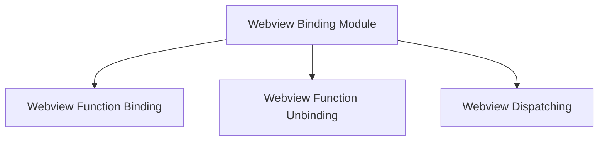

# Webview Binding Module Documentation

## Introduction

The `webview_binding` module is a crucial component within the `app_webview_glue` package, responsible for establishing and managing the communication bridge between the Go backend and the webview frontend. It provides the core functionality to bind JavaScript functions in the webview to Go functions, allowing for seamless invocation of backend logic from the frontend, and conversely, enabling the backend to interact with the webview.

## Architecture Overview

The `webview_binding` module's architecture is straightforward, focusing on the core operations of binding and unbinding functions. It leverages the `webview` library to facilitate the inter-process communication. 

This module primarily interacts with:
*   **webview_dispatching**: A sibling module likely responsible for dispatching events or handling the results of the bound function calls.
*   **app_webview_glue**: The parent module, which provides the overall glue logic for webview integration.

<!-- DIAGRAM_JSON
{
    "direction": "TD",
    "nodes": [
        {"id": "webview_binding", "label": "Webview Binding Module", "type": "module", "link": "webview_binding.md"},
        {"id": "webview_function_binding", "label": "Webview Function Binding", "type": "module", "link": "webview_function_binding.md"},
        {"id": "webview_function_unbinding", "label": "Webview Function Unbinding", "type": "module", "link": "webview_function_unbinding.md"},
        {"id": "webview_dispatching", "label": "Webview Dispatching", "type": "module", "link": "webview_dispatching.md"}

    ],
    "edges": [
        {"source": "webview_binding", "target": "webview_function_binding"},
        {"source": "webview_binding", "target": "webview_function_unbinding"},
        {"source": "webview_binding", "target": "webview_dispatching"}
    ],
    "groups": []
}
-->

## High-Level Functionality

This module is composed of the following key sub-modules, each addressing a specific aspect of webview communication:

*   ### [Webview Function Binding](webview_function_binding.md)
    Handles the binding of JavaScript functions to Go functions within the webview, facilitating communication between the frontend and backend.

*   ### [Webview Function Unbinding](webview_function_unbinding.md)
    Manages the unbinding of previously bound JavaScript functions from Go functions in the webview, cleaning up resources.