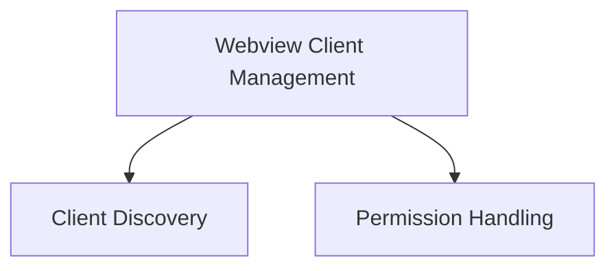

# Webview Client Management Module

## Introduction

The `webview_client_management` module is responsible for managing the interaction with WebView clients. This includes discovering available WebView clients and handling permissions requested by the WebView.

## Architecture

This module is structured into two main sub-modules:

*   **Client Discovery**: Handles the identification of available WebView clients and retrieval of their version strings.
*   **Permission Handling**: Manages permissions such as clipboard access requested by the WebView.

<!-- DIAGRAM_JSON
{
    "direction": "TD",
    "nodes": [
        {"id": "client_discovery", "label": "Client Discovery", "type": "module", "link": "client_discovery.md"},
        {"id": "permission_handling", "label": "Permission Handling", "type": "module", "link": "permission_handling.md"}
    ],
    "edges": [
        {"source": "webview_client_management", "target": "client_discovery"},
        {"source": "webview_client_management", "target": "permission_handling"}
    ],
    "groups": []
}
-->

## Sub-modules

*   [Client Discovery](client_discovery.md): Provides utilities for finding available WebView clients and retrieving their version information.
*   [Permission Handling](permission_handling.md): Manages permissions requested by the WebView, such as clipboard access.
