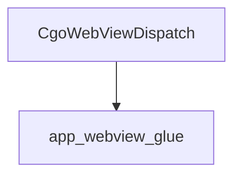

# `webview_dispatching` Module Documentation

## Introduction

The `webview_dispatching` module is a crucial component within the `app_webview_glue` system, responsible for facilitating the dispatching of tasks and updates to the webview's UI thread from potentially different execution contexts, such as Go routines (indicated by "Cgo"). It acts as a bridge, ensuring that webview operations are performed safely and correctly within the webview's own event loop.

## Purpose and Core Functionality

The primary purpose of the `webview_dispatching` module is to provide a mechanism for asynchronous invocation of functions on the webview's main thread. This is essential for maintaining UI responsiveness and preventing deadlocks or race conditions when interacting with webview elements from background threads or different programming language runtimes (like Go via Cgo).

The core functionality is encapsulated in the `CgoWebViewDispatch` component:

### `CgoWebViewDispatch`

- **Description**: This function dispatches a given argument (`arg`) to the webview (`w`) to be processed by a predefined callback function (`_webview_dispatch_cb`) on the webview's UI thread. It leverages the underlying `webview_dispatch` function provided by the webview library.
- **Signature**:
  ```c
  void CgoWebViewDispatch(webview_t w, uintptr_t arg);
  ```
- **Parameters**:
  - `w`: A handle to the webview instance.
  - `arg`: A `uintptr_t` value, typically a pointer to data or a function ID, which will be passed to the `_webview_dispatch_cb` callback.
- **Mechanism**: The `CgoWebViewDispatch` function directly calls `webview_dispatch`, passing the webview handle, a static callback `_webview_dispatch_cb`, and the provided argument. This ensures that the `_webview_dispatch_cb` is executed on the correct thread, avoiding threading issues.

## Architecture and Component Relationships

The `webview_dispatching` module is a leaf module primarily comprising the `CgoWebViewDispatch` component. Its architecture is straightforward, focusing on a single, well-defined task: dispatching operations to the webview.

It relies heavily on the `app_webview_glue` module, which is its parent and provides the necessary `webview_t` type definition, the `webview_dispatch` function, and the `_webview_dispatch_cb` callback. The `app_webview_glue` module thus serves as the direct interface to the underlying webview library.

<!-- DIAGRAM_JSON
{
    "direction": "TD",
    "nodes": [
        {"id": "cgo_webview_dispatch", "label": "CgoWebViewDispatch", "type": "component", "link": null},
        {"id": "app_webview_glue", "label": "app_webview_glue", "type": "external", "link": "app_webview_glue.md"}
    ],
    "edges": [
        {"source": "cgo_webview_dispatch", "target": "app_webview_glue"}
    ],
    "groups": []
}
-->


## How the Module Fits into the Overall System

The `webview_dispatching` module plays a critical role in enabling smooth and safe communication between the application's backend logic (potentially written in Go) and the frontend webview UI. By centralizing the dispatching mechanism, it ensures that all UI-related updates originating from non-UI threads are properly marshaled and executed on the webview's main thread.

This module is integral to the `app_webview_glue` module, which is responsible for overall integration between the application's native code and the webview. It allows for the dynamic updating of the webview interface, handling events, and executing JavaScript without violating thread safety rules. Without this dispatching mechanism, direct manipulation of the webview from background threads would lead to unpredictable behavior and crashes.