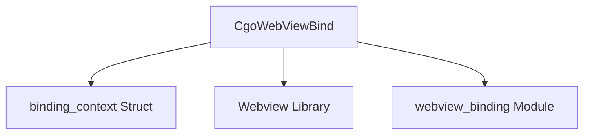

# Module: `webview_function_binding`

## Introduction
The `webview_function_binding` module is a crucial component within the `app_webview_glue` system, responsible for establishing a bridge between the Go backend and the webview frontend. Its primary function is to bind specific Go functions, identified by a name and an index, to the webview instance, allowing the frontend JavaScript to invoke these Go functions directly. This module is essential for enabling interactive user interfaces where frontend actions trigger backend logic.

## Architecture and Component Relationships

<!-- DIAGRAM_JSON
{
    "direction": "TD",
    "nodes": [
        {"id": "cgo_webview_bind", "label": "CgoWebViewBind", "type": "component", "link": null},
        {"id": "binding_context", "label": "binding_context Struct", "type": "component", "link": null},
        {"id": "webview_library", "label": "Webview Library", "type": "external", "link": null},
        {"id": "webview_binding", "label": "webview_binding Module", "type": "external", "link": "webview_binding.md"}
    ],
    "edges": [
        {"source": "cgo_webview_bind", "target": "binding_context"},
        {"source": "cgo_webview_bind", "target": "webview_library"},
        {"source": "cgo_webview_bind", "target": "webview_binding"}
    ],
    "groups": []
}
-->


The `webview_function_binding` module centers around the `CgoWebViewBind` function. This function utilizes an internal `binding_context` structure to manage the state required for each binding operation. It depends on the external `webview` library for core webview functionalities like `webview_bind` and `webview_t`. Furthermore, it interacts with its parent module, `webview_binding`, by referencing the `_webview_binding_cb` callback, which is responsible for mediating the call from the webview to the actual Go function.

## How the Module Fits into the Overall System
This module acts as a critical bridge in the `app_webview_glue` ecosystem, sitting between the Go application logic and the web-based user interface. It is a leaf module within the `app_webview_glue` -> `webview_binding` hierarchy.

By providing `CgoWebViewBind`, it enables the `webview_binding` module to effectively register Go functions with the webview. This allows JavaScript code running in the webview to call these registered Go functions, facilitating communication from the frontend to the backend. This setup is fundamental for any hybrid application where the UI is rendered via a webview and backend logic is handled by Go.

## Core Components

### `CgoWebViewBind`
- **File:** `app/webview/glue.c`
- **Purpose:** Binds a Go function to a webview instance, making it invokable from JavaScript within the webview.
- **Description:**
    The `CgoWebViewBind` function is responsible for setting up a callable Go function within the webview environment. It takes a webview instance (`webview_t w`), the `name` under which the function will be exposed in JavaScript, and an `index` that presumably identifies the specific Go function to be called on the Go side.

    Internally, `CgoWebViewBind` allocates a `binding_context` structure to store the webview instance and the Go function's index. This context is then passed to the `webview_bind` function (provided by the external `webview` library), along with the function `name` and a callback function `_webview_binding_cb`.

    The `_webview_binding_cb` (likely defined in the [webview_binding.md] module) serves as the intermediary. When JavaScript in the webview calls the function by `name`, `_webview_binding_cb` is invoked. It then uses the `binding_context` to determine which Go function (identified by `ctx->index`) to dispatch the call to, effectively bridging the webview's JavaScript call to the underlying Go implementation.

- **Code:**
```c
void CgoWebViewBind(webview_t w, const char *name, uintptr_t index) {
    struct binding_context *ctx = calloc(1, sizeof(struct binding_context));
    ctx->w = w;
    ctx->index = index;
    webview_bind(w, name, _webview_binding_cb, (void *)ctx);
}
```
