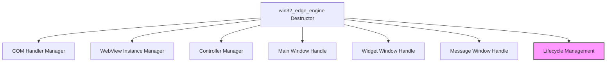

# win32_engine Module Documentation

## Introduction
The `win32_engine` module provides the Windows-specific implementation for hosting WebView components, leveraging the Microsoft Edge (Chromium-based) WebView2 runtime. It is a critical part of the `platform_engines` suite within the `app_webview_api` module, ensuring that the application's web content rendering functions correctly on Windows operating systems.

## Core Functionality
The primary role of `win32_engine` is to manage the lifecycle of the WebView2 components and their associated Windows resources. This includes:
*   Initialization and creation of the WebView2 environment.
*   Handling of UI elements such as the main window, child widget window, and message-only windows required for WebView operation.
*   Proper cleanup and release of all COM objects and Windows handles upon destruction of the WebView engine instance, preventing resource leaks and ensuring graceful application termination.

The provided core component, `app.webview.webview.win32_edge_engine`, specifically illustrates the destructor logic, which is paramount for resource management in a Win32 environment dealing with COM interfaces and native window handles.

## Architecture and Component Relationships

The `win32_edge_engine` module is structured around managing the various components that constitute a WebView2 instance on Windows. The diagram below illustrates the internal components and their relationships, along with external dependencies.

<!-- DIAGRAM_JSON
{
    "direction": "TD",
    "nodes": [
        {"id": "win32_edge_engine_dtor", "label": "win32_edge_engine Destructor", "type": "component", "link": null},
        {"id": "com_handler_mgr", "label": "COM Handler Manager", "type": "component", "link": null},
        {"id": "webview_instance_mgr", "label": "WebView Instance Manager", "type": "component", "link": null},
        {"id": "controller_mgr", "label": "Controller Manager", "type": "component", "link": null},
        {"id": "main_window_handle", "label": "Main Window Handle", "type": "component", "link": null},
        {"id": "widget_window_handle", "label": "Widget Window Handle", "type": "component", "link": null},
        {"id": "message_window_handle", "label": "Message Window Handle", "type": "component", "link": null},
        {"id": "lifecycle_management", "label": "Lifecycle Management", "type": "external", "link": "lifecycle_management.md"}
    ],
    "edges": [
        {"source": "win32_edge_engine_dtor", "target": "com_handler_mgr"},
        {"source": "win32_edge_engine_dtor", "target": "webview_instance_mgr"},
        {"source": "win32_edge_engine_dtor", "target": "controller_mgr"},
        {"source": "win32_edge_engine_dtor", "target": "main_window_handle"},
        {"source": "win32_edge_engine_dtor", "target": "widget_window_handle"},
        {"source": "win32_edge_engine_dtor", "target": "message_window_handle"},
        {"source": "win32_edge_engine_dtor", "target": "lifecycle_management"}
    ],
    "groups": []
}
-->

## Overall System Fit
As a `platform_engine`, `win32_engine` integrates into the `app_webview_api` framework, providing the concrete implementation for displaying web content on Windows. This allows the higher-level `app_webview_api` and `app_webview_glue` modules to abstract away platform-specific details, presenting a unified interface to the `app_ui_components` and other UI-related modules. By encapsulating Windows-specific WebView management, it enables the application to deliver a consistent user experience across different operating systems, with each `platform_engine` (e.g., [gtk_engine](gtk_engine.md), [cocoa_engine](cocoa_engine.md)) handling its respective environment.
