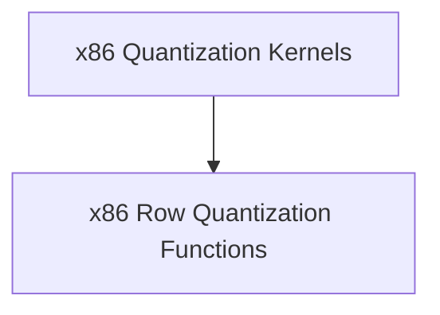

# x86_quantization_kernels Module Documentation

## Introduction and Purpose

The `x86_quantization_kernels` module provides optimized kernel implementations for quantization operations specifically tailored for x86 architectures. This module is a critical component within the `ggml` backend, enabling efficient handling of quantized data types, which are essential for reducing memory footprint and improving performance in machine learning models. Its primary purpose is to offer high-performance routines for converting floating-point data into various quantized integer formats.

## Architecture Overview

The `x86_quantization_kernels` module is structured to encapsulate specialized quantization functions. It leverages x86-specific CPU instructions (like AVX/AVX2) to accelerate these operations. The module's design focuses on providing low-level, high-throughput functions for row-wise quantization.

<!-- DIAGRAM_JSON
{
    "direction": "TD",
    "nodes": [
        {"id": "x86_quantization_kernels", "label": "x86 Quantization Kernels", "type": "module", "link": "x86_quantization_kernels.md"},
        {"id": "x86_row_quantization_functions", "label": "x86 Row Quantization Functions", "type": "module", "link": "x86_row_quantization_functions.md"}
    ],
    "edges": [
        {"source": "x86_quantization_kernels", "target": "x86_row_quantization_functions"}
    ],
    "groups": []
}
-->

## Sub-modules

### x86 Row Quantization Functions

This sub-module, documented in [x86_row_quantization_functions.md](x86_row_quantization_functions.md), contains the core implementations for row-wise quantization specific to x86 CPUs. It includes highly optimized functions such as `quantize_row_q8_1` and `quantize_row_q8_K`, which are crucial for converting floating-point data into `Q8_1` and `Q8_K` quantized formats, respectively. These functions are designed to maximize performance by utilizing advanced vector instructions available on x86 processors.