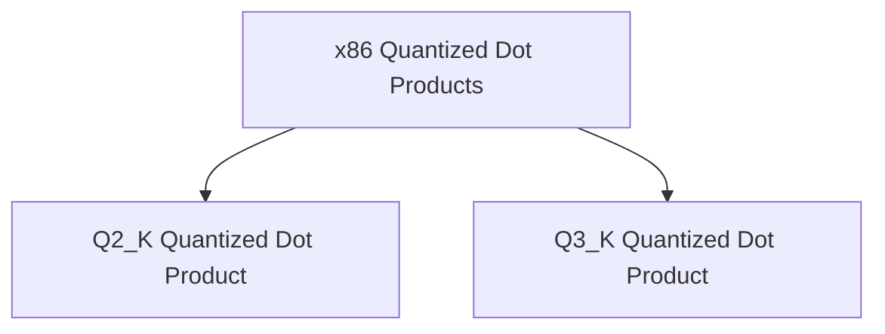

# x86_quantized_dot_products Module Documentation

## Introduction

The `x86_quantized_dot_products` module is a critical component within the `ggml` (Georgi's Machine Learning) library, specifically designed to accelerate vector dot product operations for quantized data types on x86-based CPUs. This module leverages advanced CPU instruction sets like AVX2 and AVX to provide highly optimized implementations for `Q2_K` and `Q3_K` quantized data, which are commonly used in efficient neural network inference.

Its primary purpose is to enable faster computations by directly utilizing hardware capabilities for operations that involve lower-precision integer types, thereby significantly improving performance and reducing memory bandwidth requirements in machine learning models.

## Architecture Overview

The `x86_quantized_dot_products` module consists of highly optimized sub-modules, each focusing on a specific quantized data type for vector dot product computations. These sub-modules directly interact with the underlying CPU architecture to exploit SIMD (Single Instruction, Multiple Data) capabilities for parallel processing of quantized vectors.

<!-- DIAGRAM_JSON
{
    "direction": "TD",
    "nodes": [
        {"id": "q2_k_dot_product", "label": "Q2_K Quantized Dot Product", "type": "module", "link": "q2_k_dot_product.md"},
        {"id": "q3_k_dot_product", "label": "Q3_K Quantized Dot Product", "type": "module", "link": "q3_k_dot_product.md"}
    ],
    "edges": [
        {"source": "x86_quantized_dot_products", "target": "q2_k_dot_product"},
        {"source": "x86_quantized_dot_products", "target": "q3_k_dot_product"}
    ],
    "groups": []
}
-->

## Sub-modules

This module is composed of the following sub-modules:

*   **[Q2_K Quantized Dot Product](q2_k_dot_product.md)**: Handles vector dot product operations for Q2_K quantized data.
*   **[Q3_K Quantized Dot Product](q3_k_dot_product.md)**: Handles vector dot product operations for Q3_K quantized data.

These sub-modules provide the low-level, high-performance implementations required for efficient execution of quantized machine learning models on x86 processors.