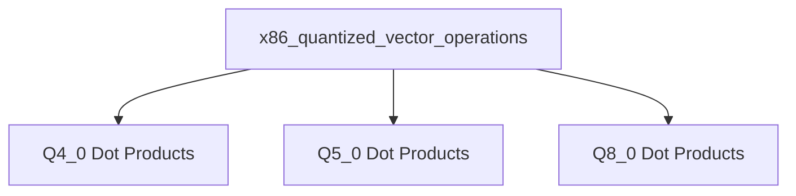

# x86_quantized_vector_operations Module Documentation

## Introduction

The `x86_quantized_vector_operations` module provides highly optimized vector dot product operations for various quantized data types on x86 architectures. These operations are crucial for efficient execution of machine learning models that utilize quantized weights and activations, particularly within the GGML library context. The module leverages x86 specific intrinsics (like AVX2, AVX, and SSSE3) to achieve significant performance improvements.

## Architecture Overview

The module is structured around specific quantized vector dot product functions, each tailored for different input quantization formats. These functions are designed to interact directly with quantized data blocks and provide a floating-point sum of their dot product. The module is a critical component of the `ggml_cpu_x86_quants` module, contributing to the overall CPU-based quantization capabilities.

<!-- DIAGRAM_JSON
{
    "direction": "TD",
    "nodes": [
        {"id": "q4_0_dot_products", "label": "Q4_0 Dot Products", "type": "module", "link": "q4_0_dot_products.md"},
        {"id": "q5_0_dot_products", "label": "Q5_0 Dot Products", "type": "module", "link": "q5_0_dot_products.md"},
        {"id": "q8_0_dot_products", "label": "Q8_0 Dot Products", "type": "module", "link": "q8_0_dot_products.md"}
    ],
    "edges": [
        {"source": "x86_quantized_vector_operations", "target": "q4_0_dot_products"},
        {"source": "x86_quantized_vector_operations", "target": "q5_0_dot_products"},
        {"source": "x86_quantized_vector_operations", "target": "q8_0_dot_products"}
    ],
    "groups": []
}
-->

## Sub-modules

This module is composed of several sub-modules, each focusing on specific quantized vector dot product computations:

### [Q4_0 Dot Products](q4_0_dot_products.md)
This sub-module provides the `ggml_vec_dot_q4_0_q8_0` function, which computes the dot product of Q4_0 quantized input vectors with Q8_0 quantized weight vectors. It includes optimized implementations for AVX2, AVX, and SSSE3 instruction sets to maximize performance on compatible x86 CPUs.

### [Q5_0 Dot Products](q5_0_dot_products.md)
This sub-module offers the `ggml_vec_dot_q5_0_q8_0` function, designed for calculating the dot product between Q5_0 quantized input vectors and Q8_0 quantized weight vectors. It leverages AVX2 and AVX intrinsics for accelerated computation.

### [Q8_0 Dot Products](q8_0_dot_products.md)
This sub-module contains the `ggml_vec_dot_q8_0_q8_0` function, which performs dot product operations between Q8_0 quantized input vectors and Q8_0 quantized weight vectors. Optimized with AVX2 and AVX instructions, it ensures efficient processing of Q8_0 data.
