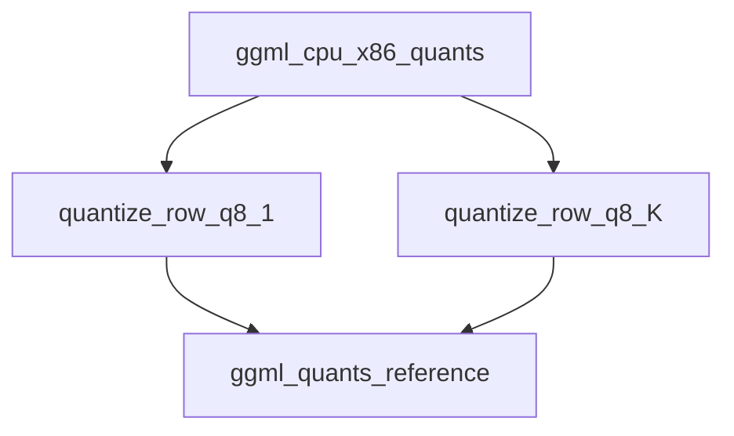

# x86_row_quantization_functions Module Documentation

## Introduction

This module, `x86_row_quantization_functions`, provides highly optimized functions for quantizing rows of floating-point numbers into 8-bit integer representations specifically tailored for x86 architectures. It is a critical component within the GGML library's CPU backend, enabling efficient memory usage and faster computation for quantized models.

## Architecture and Component Relationships

This module contains specialized implementations for quantizing data rows using x86 specific intrinsics (AVX/AVX2) when available, and falls back to a reference implementation otherwise. These functions are part of the broader `ggml_cpu_x86_quants` module, which focuses on x86 CPU-specific quantization operations.

<!-- DIAGRAM_JSON
{
    "direction": "TD",
    "nodes": [
        {"id": "quantize_row_q8_1", "label": "quantize_row_q8_1", "type": "component", "link": null},
        {"id": "quantize_row_q8_K", "label": "quantize_row_q8_K", "type": "component", "link": null},
        {"id": "ggml_cpu_x86_quants", "label": "ggml_cpu_x86_quants", "type": "external", "link": "ggml_cpu_x86_quants.md"},
        {"id": "ggml_quants_reference", "label": "ggml_quants_reference", "type": "external", "link": "ggml_quants_reference.md"}
    ],
    "edges": [
        {"source": "quantize_row_q8_1", "target": "ggml_quants_reference"},
        {"source": "quantize_row_q8_K", "target": "ggml_quants_reference"},
        {"source": "ggml_cpu_x86_quants", "target": "quantize_row_q8_1"},
        {"source": "ggml_cpu_x86_quants", "target": "quantize_row_q8_K"}
    ],
    "groups": []
}
-->

## Core Functionality

### `quantize_row_q8_1`

`quantize_row_q8_1` is responsible for quantizing a row of `k` floating-point numbers into the `Q8_1` format. This function is highly optimized using `AVX2` or `AVX` intrinsics for improved performance on compatible x86 CPUs. It calculates a scaling factor (`d`) based on the maximum absolute value in the block and then quantizes the float values to signed 8-bit integers. It also computes a sum of the quantized values, which is stored along with the scaling factor.

*   **Input**: `x` (const float pointer) - The input row of floating-point numbers.
*   **Output**: `vy` (void pointer) - The output buffer for quantized `block_q8_1` data.
*   **Parameter**: `k` (int64_t) - The number of elements in the row.
*   **Optimization**: Leverages `_mm256_` intrinsics for vector processing, specifically `AVX2` and `AVX` instructions for parallel computation of max absolute values, multiplication, rounding, and packing operations. If `AVX2` or `AVX` are not defined, it falls back to a reference implementation, `quantize_row_q8_1_ref` found in the [ggml_quants_reference](ggml_quants_reference.md) module.

### `quantize_row_q8_K`

`quantize_row_q8_K` serves as a wrapper function that delegates the quantization of a row of floating-point numbers to the `quantize_row_q8_K_ref` function. This suggests that `quantize_row_q8_K_ref` provides the primary implementation for `Q8_K` quantization, likely a more generic or reference implementation that might not be as heavily optimized for specific x86 intrinsics as `quantize_row_q8_1`.

*   **Input**: `x` (const float pointer) - The input row of floating-point numbers.
*   **Output**: `y` (void pointer) - The output buffer for quantized `Q8_K` data.
*   **Parameter**: `k` (int64_t) - The number of elements in the row.
*   **Reference**: This function directly calls `quantize_row_q8_K_ref`, which is expected to be found in the [ggml_quants_reference](ggml_quants_reference.md) module.

## Integration with the Overall System

The `x86_row_quantization_functions` module is an integral part of the `ggml` library's CPU backend, specifically contributing to the `ggml_cpu_x86_quants` module. Its purpose is to provide highly optimized quantization routines for `Q8_1` and `Q8_K` data types when running on x86 processors. By leveraging x86 specific instruction sets like AVX/AVX2, these functions contribute to significant performance improvements and reduced memory footprint for neural network models that utilize 8-bit quantization. This module ensures that `ggml` can efficiently execute quantized models on CPUs, acting as a bridge between high-level model representations and low-level, hardware-accelerated operations.