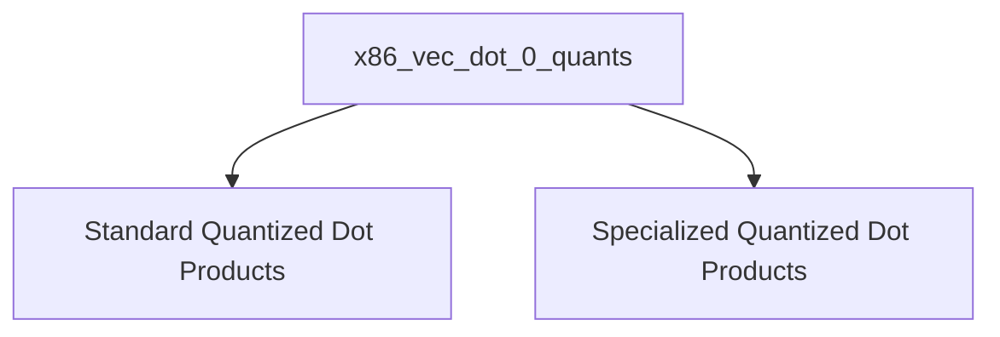

# x86_vec_dot_0_quants Module Documentation

## Introduction and Purpose

The `x86_vec_dot_0_quants` module provides highly optimized implementations for various quantized vector dot product operations specifically tailored for x86 architectures. These routines are crucial for efficient inference in machine learning models, particularly those leveraging quantized weights to reduce memory footprint and computational cost. The optimizations often involve leveraging CPU instruction sets like AVX2, AVX, and SSSE3 for parallel processing.

## Architecture Overview

The `x86_vec_dot_0_quants` module is structured into sub-modules, each focusing on a specific set of quantized dot product operations. This modular design enhances maintainability and allows for independent development and optimization of different quantization schemes. The primary goal is to provide fast and accurate vector dot product computations for common and specialized quantization formats.

## High-Level Functionality

This module is composed of the following key sub-modules:

*   **[Standard Quantized Dot Products](standard_quantized_dot_products.md)**: This sub-module contains optimized vector dot product functions for widely used quantization types such as Q4_0, Q5_0, and Q8_0. These are foundational for many quantized models.

*   **[Specialized Quantized Dot Products](specialized_quantized_dot_products.md)**: This sub-module focuses on more advanced or experimental quantization formats, including MXFP4 (mixed-precision 4-bit float) and IQ4_NL (integer quantization 4-bit non-linear). These offer different trade-offs between precision and performance.

<!-- DIAGRAM_JSON
{
    "direction": "TD",
    "nodes": [
        {"id": "standard_quantized_dot_products", "label": "Standard Quantized Dot Products", "type": "module", "link": "standard_quantized_dot_products.md"},
        {"id": "specialized_quantized_dot_products", "label": "Specialized Quantized Dot Products", "type": "module", "link": "specialized_quantized_dot_products.md"}
    ],
    "edges": [
        {"source": "x86_vec_dot_0_quants", "target": "standard_quantized_dot_products"},
        {"source": "x86_vec_dot_0_quants", "target": "specialized_quantized_dot_products"}
    ],
    "groups": []
}
-->

