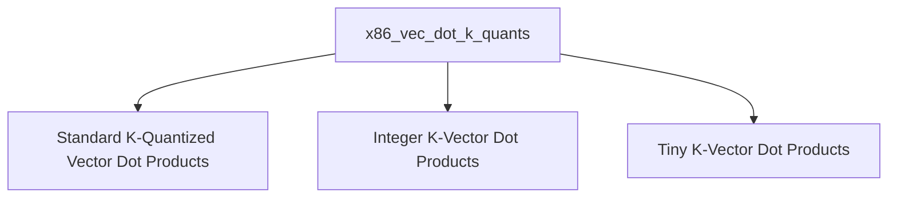

# x86_vec_dot_k_quants Module Overview

## Purpose of the Module

The `x86_vec_dot_k_quants` module is a critical component within the GGML CPU backend, specifically designed to provide highly optimized vector dot product implementations for various K-quantized data types on x86 architectures. This module leverages advanced instruction sets like AVX and AVX2 to accelerate computations for quantized neural networks, significantly improving performance and efficiency for CPU-based inference. It supports a wide range of K-quantization schemes, including standard Q2_K, Q3_K, Q4_K, Q5_K, Q6_K, integer quantization (IQ1, IQ2, IQ3, IQ4), and tiny quantization (TQ1, TQ2).

## Architecture of the Module

The `x86_vec_dot_k_quants` module is structured into several sub-modules, each specializing in a particular category of K-quantized vector dot product operations. This modular design allows for targeted optimizations and clear organization of the various quantization kernels.

## References to Core Components Documentation

The `x86_vec_dot_k_quants` module and its sub-modules expose the following core components:

*   **Standard K-Quantized Vector Dot Products (`standard_k_vec_dots.md`)**:
    *   [`ggml_vec_dot_q2_K_q8_K`](ggml_vec_dot_q2_K_q8_K.md): Optimized dot product for Q2_K and Q8_K quantized tensors.
    *   [`ggml_vec_dot_q3_K_q8_K`](ggml_vec_dot_q3_K_q8_K.md): Optimized dot product for Q3_K and Q8_K quantized tensors.
    *   [`ggml_vec_dot_q4_K_q8_K`](ggml_vec_dot_q4_K_q8_K.md): Optimized dot product for Q4_K and Q8_K quantized tensors.
    *   [`ggml_vec_dot_q5_K_q8_K`](ggml_vec_dot_q5_K_q8_K.md): Optimized dot product for Q5_K and Q8_K quantized tensors.
    *   [`ggml_vec_dot_q6_K_q8_K`](ggml_vec_dot_q6_K_q8_K.md): Optimized dot product for Q6_K and Q8_K quantized tensors.

*   **Integer K-Vector Dot Products (`integer_k_vec_dots.md`)**:
    *   [`ggml_vec_dot_iq1_s_q8_K`](ggml_vec_dot_iq1_s_q8_K.md): Optimized dot product for IQ1_S and Q8_K quantized tensors.
    *   [`ggml_vec_dot_iq1_m_q8_K`](ggml_vec_dot_iq1_m_q8_K.md): Optimized dot product for IQ1_M and Q8_K quantized tensors.
    *   [`ggml_vec_dot_iq2_xs_q8_K`](ggml_vec_dot_iq2_xs_q8_K.md): Optimized dot product for IQ2_XS and Q8_K quantized tensors.
    *   [`ggml_vec_dot_iq2_s_q8_K`](ggml_vec_dot_iq2_s_q8_K.md): Optimized dot product for IQ2_S and Q8_K quantized tensors.
    *   [`ggml_vec_dot_iq2_xxs_q8_K`](ggml_vec_dot_iq2_xxs_q8_K.md): Optimized dot product for IQ2_XXS and Q8_K quantized tensors.
    *   [`ggml_vec_dot_iq3_xxs_q8_K`](ggml_vec_dot_iq3_xxs_q8_K.md): Optimized dot product for IQ3_XXS and Q8_K quantized tensors.
    *   [`ggml_vec_dot_iq3_s_q8_K`](ggml_vec_dot_iq3_s_q8_K.md): Optimized dot product for IQ3_S and Q8_K quantized tensors.
    *   [`ggml_vec_dot_iq4_xs_q8_K`](ggml_vec_dot_iq4_xs_q8_K.md): Optimized dot product for IQ4_XS and Q8_K quantized tensors.

*   **Tiny K-Vector Dot Products (`tiny_k_vec_dots.md`)**:
    *   [`ggml_vec_dot_tq1_0_q8_K`](ggml_vec_dot_tq1_0_q8_K.md): Optimized dot product for TQ1_0 and Q8_K quantized tensors.
    *   [`ggml_vec_dot_tq2_0_q8_K`](ggml_vec_dot_tq2_0_q8_K.md): Optimized dot product for TQ2_0 and Q8_K quantized tensors.