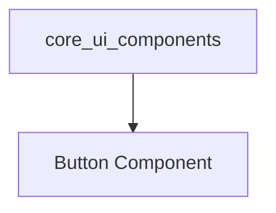

# Basic UI Elements Module

## Introduction
The `basic_ui_elements` module provides fundamental and reusable user interface components for the client application. Its primary goal is to offer a consistent and easily integrable set of basic UI building blocks that can be utilized across various parts of the application, ensuring a uniform look and feel.

This module is a leaf module within the `core_ui_components` module, focusing on individual, atomic UI elements.

## Core Functionality
The `basic_ui_elements` module currently encapsulates the `Button` component, a versatile and styled button element.

### Button Component (`client.components.Button.Button`)
The `Button` component is a functional React component designed for user interaction. It provides a styled button that can display an icon, child elements (typically text), and respond to click events.

**Key Features:**
*   **Customizable Content**: Supports rendering an `icon` and `children` (e.g., text, other JSX elements) inside the button.
*   **Click Handling**: An `onClick` prop allows for easy integration of event handlers.
*   **Styling**: Applies a default set of styles for a consistent appearance, with the option to extend or override them via the `className` prop.

**Code Snippet:**
```javascript
function Button({ icon, children, onClick, className }) {
  return (
    <button
      className={`bg-gray-800 text-white rounded-full p-4 flex items-center gap-1 hover:opacity-90 ${className}`}
      onClick={onClick}
    >
      {icon}
      {children}
    </button>
  );
}
```

## Architecture and Relationships

The `basic_ui_elements` module provides low-level UI components. It is a part of the `core_ui_components` module, which groups together core user interface elements. Other modules higher up in the application hierarchy, such as `page_rendering` and potentially `session_management`, will consume these basic elements to construct more complex UIs.

<!-- DIAGRAM_JSON
{
    "direction": "TD",
    "nodes": [
        {"id": "button_component", "label": "Button Component", "type": "component", "link": null},
        {"id": "core_ui_components", "label": "core_ui_components", "type": "external", "link": "core_ui_components.md"}
    ],
    "edges": [
        {"source": "core_ui_components", "target": "button_component"}
    ],
    "groups": []
}
-->


## Integration with the Overall System
The `basic_ui_elements` module, through its `Button` component, serves as a foundational layer for user interaction within the client application. It is directly consumed by the [core_ui_components](core_ui_components.md) module, which then provides these elements to higher-level components and pages to build the complete user interface. This modular approach ensures that UI elements are consistent, maintainable, and easily extendable.
