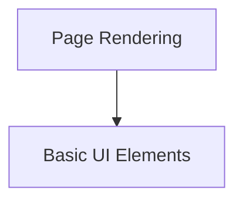

# Core UI Components Module Documentation

## Introduction and Purpose
The `core_ui_components` module encapsulates fundamental UI elements and page rendering mechanisms critical for the client-side application's structure and presentation. It provides the building blocks for user interaction and the initial display of the application.

## Architecture Overview
The module is structured into two key sub-modules: `basic_ui_elements` and `page_rendering`. `basic_ui_elements` focuses on reusable, atomic UI components, while `page_rendering` manages how these components are assembled and delivered to the user, both client-side and server-side.

### Module Diagram

<!-- DIAGRAM_JSON
{
    "direction": "TD",
    "nodes": [
        {"id": "basic_ui_elements", "label": "Basic UI Elements", "type": "module", "link": "basic_ui_elements.md"},
        {"id": "page_rendering", "label": "Page Rendering", "type": "module", "link": "page_rendering.md"}
    ],
    "edges": [
        {"source": "page_rendering", "target": "basic_ui_elements"}
    ],
    "groups": []
}
-->

## High-Level Functionality

### Basic UI Elements
This sub-module contains foundational UI components like buttons, which are used across the application to enable user interactions. For more details, refer to [basic_ui_elements.md](basic_ui_elements.md).

### Page Rendering
This sub-module is responsible for the overall page structure, including the root component (`App`) and the server-side rendering logic that prepares the initial HTML for the client. For more details, refer to [page_rendering.md](page_rendering.md).
