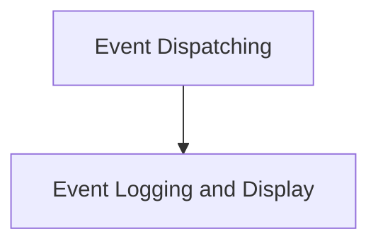

# Event and Messaging Module

## Introduction

The `event_and_messaging` module is responsible for managing the communication flow within the application, encompassing both the dispatching of client-side events to the backend and the logging and display of various system events. It ensures that user interactions and system responses are appropriately handled and presented.

## Architecture Overview

The module is structured into two primary sub-modules:

1.  **Event Dispatching**: Focuses on sending client-generated events, such as user messages, to the core application logic.
2.  **Event Logging and Display**: Manages the capture, processing, and visual representation of all events, providing a historical log for debugging and user feedback.

<!-- DIAGRAM_JSON
{
    "direction": "TD",
    "nodes": [
        {"id": "event_dispatching", "label": "Event Dispatching", "type": "module", "link": "event_dispatching.md"},
        {"id": "event_logging_and_display", "label": "Event Logging and Display", "type": "module", "link": "event_logging_and_display.md"}
    ],
    "edges": [
        {"source": "event_dispatching", "target": "event_logging_and_display"}
    ],
    "groups": []
}
-->

## Sub-modules

### [Event Dispatching](event_dispatching.md)

This sub-module handles the creation and transmission of events from the client to the server. It includes functions for formatting messages and sending them through the established data channel.

### [Event Logging and Display](event_logging_and_display.md)

This sub-module is responsible for presenting a chronological log of all events within the application's UI. It processes incoming events and renders them in a user-friendly format, allowing for easy monitoring and debugging.