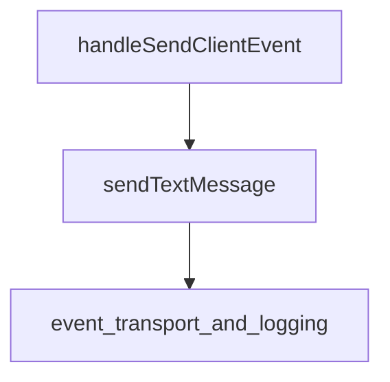

# event_creation Module Documentation

## Introduction

The `event_creation` module is responsible for constructing and initiating the dispatch of various client-side events within the application, primarily focusing on user interactions such as sending text messages. It acts as a crucial interface for translating user input and application logic into structured event objects that can be processed and communicated throughout the system.

## Core Functionality

This module encapsulates the logic for generating specific types of events, ensuring they conform to the system's event schema before being dispatched. Its primary components include:

### `sendTextMessage`

This function is responsible for creating a `conversation.item.create` event when a user sends a text message. It constructs a detailed event object specifying the event type, item type (`message`), role (`user`), and the content of the message. After constructing this event, it delegates the actual dispatching to the `sendClientEvent` function.

### `handleSendClientEvent`

This function serves as a handler for user-initiated client events, specifically designed to process and send user text messages. It utilizes `sendTextMessage` to format the message and then clears the input field, preparing for subsequent user input. This component typically integrates with UI elements like input fields and send buttons, facilitating a seamless user experience for message submission.

## Architecture and Component Relationships

The `event_creation` module plays a pivotal role in the event dispatching pipeline. It relies on external modules for the actual transportation and logging of events, while focusing internally on event object generation.

<!-- DIAGRAM_JSON
{
    "direction": "TD",
    "nodes": [
        {"id": "handle_send_client_event", "label": "handleSendClientEvent", "type": "component", "link": null},
        {"id": "send_text_message", "label": "sendTextMessage", "type": "component", "link": null},
        {"id": "event_transport_and_logging", "label": "event_transport_and_logging", "type": "external", "link": "event_transport_and_logging.md"}
    ],
    "edges": [
        {"source": "handle_send_client_event", "target": "send_text_message"},
        {"source": "send_text_message", "target": "event_transport_and_logging"}
    ],
    "groups": []
}
-->

## How it fits into the overall system

The `event_creation` module is a sub-module of [event_dispatching](event_dispatching.md), which itself is part of the broader [event_and_messaging](event_and_messaging.md) system. Its primary role is to prepare events for dispatch. It works in conjunction with [session_management](session_management.md) components, which might trigger or listen for these events, and [event_logging_and_display](event_logging_and_display.md) for visualizing the generated events. By centralizing event creation logic, this module ensures consistency in how events are structured and introduced into the application's communication flow.