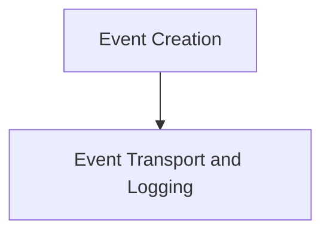

# `event_dispatching` Module Documentation

## Introduction

The `event_dispatching` module is a core component responsible for the creation, handling, and transmission of client-side events within the application. It acts as the central hub for dispatching various events, such as user messages and system responses, ensuring they are correctly formatted, logged, and sent to the appropriate channels.

## Architecture Overview

The `event_dispatching` module is logically divided into two primary sub-modules: `event_creation` and `event_transport_and_logging`. The `event_creation` sub-module focuses on generating and preparing events based on user interactions or application logic. These created events are then passed to the `event_transport_and_logging` sub-module, which handles the actual transmission over a data channel and maintains a local log of all dispatched events. This clear separation of concerns ensures efficient event management and robust error handling.

## Sub-modules

### Event Creation
This sub-module is responsible for the initial generation and structuring of events. It encapsulates the logic for transforming user actions, such as sending a text message, into a standardized event format that can be processed by the system.
For more details, refer to the [event_creation documentation](event_creation.md).

### Event Transport and Logging
This sub-module manages the actual sending of events to the backend via a data channel. It also handles the local logging of all events, ensuring a historical record is maintained for debugging and auditing purposes.
For more details, refer to the [event_transport_and_logging documentation](event_transport_and_logging.md).

<!-- DIAGRAM_JSON
{
    "direction": "TD",
    "nodes": [
        {"id": "event_creation", "label": "Event Creation", "type": "module", "link": "event_creation.md"},
        {"id": "event_transport_and_logging", "label": "Event Transport and Logging", "type": "module", "link": "event_transport_and_logging.md"}
    ],
    "edges": [
        {"source": "event_creation", "target": "event_transport_and_logging"}
    ],
    "groups": []
}
-->

