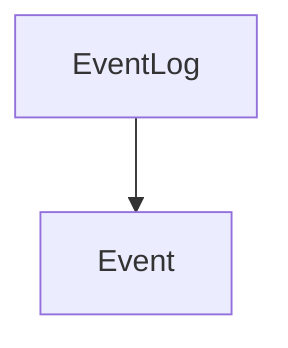

# event_display_components

## Introduction

The `event_display_components` module is responsible for rendering and displaying a stream of events within the application's user interface. It provides components for listing multiple events (`EventLog`) and for presenting individual events with detailed information (`Event`). This module plays a crucial role in providing users with visibility into client and server interactions.

## Architecture and Component Relationships

This module contains two primary components:

*   **`EventLog`**: The main container component that receives a list of events and orchestrates their display.
*   **`Event`**: A sub-component used by `EventLog` to render each individual event, allowing for expansion to view raw event data.

The `EventLog` component iterates through a provided array of events, filtering out duplicate "delta" events to ensure only the latest of each type is displayed per render pass. Each event is then passed to an `Event` component for individual rendering.

<!-- DIAGRAM_JSON
{
    "direction": "TD",
    "nodes": [
        {"id": "event_log", "label": "EventLog", "type": "component", "link": null},
        {"id": "event", "label": "Event", "type": "component", "link": null}
    ],
    "edges": [
        {"source": "event_log", "target": "event"}
    ],
    "groups": []
}
-->



## Core Functionality

### `EventLog` Component

**Purpose**: Displays a chronological list of events.

**Key Features**:
*   Receives an `events` array as a prop.
*   Filters "delta" events to show only one instance of each delta event type per render cycle, preventing visual clutter.
*   Renders an `Event` component for each event in the filtered list.
*   Displays a "Awaiting events..." message when no events are present.

**Code Snippet (`client.components.EventLog.EventLog`):**
```javascript
function EventLog({ events }) {
  const eventsToDisplay = [];
  let deltaEvents = {};

  events.forEach((event) => {
    if (event.type.endsWith("delta")) {
      if (deltaEvents[event.type]) {
        // for now just log a single event per render pass
        return;
      } else {
        deltaEvents[event.type] = event;
      }
    }

    eventsToDisplay.push(
      <Event key={event.event_id} event={event} timestamp={event.timestamp} />,
    );
  });

  return (
    <div className="flex flex-col gap-2 overflow-x-auto">
      {events.length === 0 ? (
        <div className="text-gray-500">Awaiting events...</div>
      ) : (
        eventsToDisplay
      )}
    </div>
  );
}
```

### `Event` Component

**Purpose**: Renders a single event with an expandable view for its raw data.

**Key Features**:
*   Receives `event` and `timestamp` as props.
*   Indicates whether an event originated from the client or the server using distinct icons and text.
*   Displays the event type and timestamp.
*   Allows users to expand and collapse a detailed JSON view of the event data.

**Code Snippet (`client.components.EventLog.Event`):**
```javascript
function Event({ event, timestamp }) {
  const [isExpanded, setIsExpanded] = useState(false);

  const isClient = event.event_id && !event.event_id.startsWith("event_");

  return (
    <div className="flex flex-col gap-2 p-2 rounded-md bg-gray-50">
      <div
        className="flex items-center gap-2 cursor-pointer"
        onClick={() => setIsExpanded(!isExpanded)}
      >
        {isClient ? (
          <ArrowDown className="text-blue-400" />
        ) : (
          <ArrowUp className="text-green-400" />
        )}
        <div className="text-sm text-gray-500">
          {isClient ? "client:" : "server:"}
          &nbsp;{event.type} | {timestamp}
        </div>
      </div>
      <div
        className={`text-gray-500 bg-gray-200 p-2 rounded-md overflow-x-auto ${}
          isExpanded ? "block" : "hidden"
        }`}
      >
        <pre className="text-xs">{JSON.stringify(event, null, 2)}</pre>
      </div>
    </div>
  );
}
```

## Integration with the Overall System

The `event_display_components` module is a crucial part of the [event_logging_and_display](event_logging_and_display.md) module, which itself is nested within the broader [event_and_messaging](event_and_messaging.md) architecture. It serves as the visual output for events processed and managed by the [event_dispatching](event_dispatching.md) module and other parts of the system responsible for generating client and server events. By providing a clear and interactive log, it assists developers and users in understanding the flow of operations within the application.

