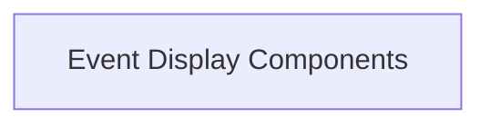

# Event Logging and Display Module

The `event_logging_and_display` module is responsible for rendering and presenting system events within the user interface. It provides components for displaying a stream of events and individual event details, enabling users to monitor system activity and debug issues.

## Architecture Overview

The module comprises core UI components dedicated to event visualization. The `EventLog` component acts as the primary container, iterating through a list of events and delegating the rendering of each individual event to the `Event` component. This clear separation of concerns ensures that the display of the event list and the details of a single event are managed independently.

<!-- DIAGRAM_JSON
{
    "direction": "TD",
    "nodes": [
        {"id": "event_display_components", "label": "Event Display Components", "type": "module", "link": "event_display_components.md"}
    ],
    "edges": [],
    "groups": []
}
-->

## Sub-modules

This module contains the following sub-modules:

*   **[Event Display Components](event_display_components.md)**: Handles the rendering and interaction for both the overall event log and individual event entries. This module includes functionality for expanding event details and differentiating between client and server-originated events.