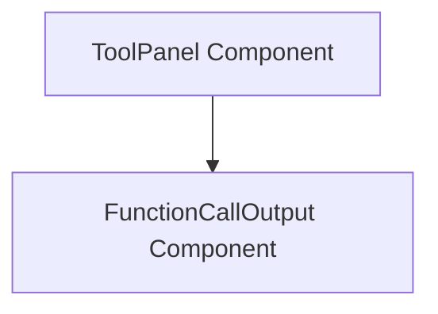

# `function_call_output_display` Module Documentation

## Introduction

The `function_call_output_display` module is a leaf module responsible for rendering the visual output of function calls within the application's user interface. It specifically handles the presentation of structured function call results, such as theme and color information, in an easily digestible format.

## Core Functionality

The primary component within this module is `FunctionCallOutput`, which takes the raw output of a function call and transforms it into a user-friendly display. It parses specific arguments from the function call output to extract and visualize data like themes and associated colors, ensuring that users can quickly understand the results of executed tools or operations.

### `FunctionCallOutput` Component (`client.components.ToolPanel.FunctionCallOutput`)

This React component is designed to display the structured output of a function call. It expects a `functionCallOutput` prop, which contains the arguments for rendering. Currently, it supports displaying a "theme" and a list of "colors" by parsing a JSON string from the `functionCallOutput.arguments` property. It renders these as text and visually distinct color boxes, respectively, along with the raw JSON output for debugging or detailed inspection.

## Architecture and Component Relationships

The `function_call_output_display` module primarily interacts with the `tool_panel_component` module, which is responsible for the overall `ToolPanel` display. The `ToolPanel` component acts as the parent, passing the `functionCallOutput` data to the `FunctionCallOutput` component for rendering.

<!-- DIAGRAM_JSON
{
    "direction": "TD",
    "nodes": [
        {"id": "function_call_output", "label": "FunctionCallOutput Component", "type": "component", "link": null},
        {"id": "tool_panel_component", "label": "ToolPanel Component", "type": "external", "link": "tool_panel_component.md"}
    ],
    "edges": [
        {"source": "tool_panel_component", "target": "function_call_output"}
    ],
    "groups": []
}
-->

## How the Module Fits into the Overall System

This module is a critical part of the `ui_and_tools` subsystem, specifically nested under `tool_panel`. It serves as the visual representation layer for results generated by various tools or functions within the application. By providing clear and immediate feedback on function call outcomes, it enhances the user experience and aids in debugging and monitoring the system's operations. It receives data orchestrated by the `tool_panel` and ultimately contributes to the dynamic content displayed on the `index` page, which is rendered by `core_ui_components`.