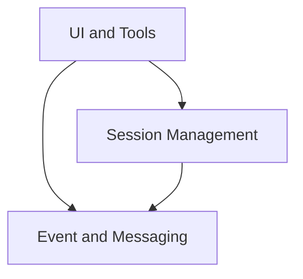

# Main Module Documentation

## Introduction
This document provides comprehensive documentation for the main client-side application module. It serves as the central orchestrator for real-time communication sessions with an AI model, handling UI rendering, user interactions, session management, and event logging.

## Architecture Overview
The main module is structured into several key sub-modules, each responsible for a distinct aspect of the application's functionality. This modular design promotes maintainability, scalability, and a clear separation of concerns.

<!-- DIAGRAM_JSON
{
    "direction": "TD",
    "nodes": [
        {"id": "session_management", "label": "Session Management", "type": "module", "link": "session_management.md"},
        {"id": "event_and_messaging", "label": "Event and Messaging", "type": "module", "link": "event_and_messaging.md"},
        {"id": "ui_and_tools", "label": "UI and Tools", "type": "module", "link": "ui_and_tools.md"}
    ],
    "edges": [
        {"source": "ui_and_tools", "target": "session_management"},
        {"source": "ui_and_tools", "target": "event_and_messaging"},
        {"source": "session_management", "target": "event_and_messaging"}
    ],
    "groups": []
}
-->

## Sub-modules

### [Session Management](session_management.md)
This sub-module is responsible for the complete lifecycle of a real-time communication session, from initiation to termination. It includes core functionalities for establishing peer connections, managing audio and data channels, and controlling the overall session state.

### [Event and Messaging](event_and_messaging.md)
This sub-module handles all aspects of client-server communication. It provides mechanisms for sending user text messages and other client events, as well as logging and displaying all incoming and outgoing events in an organized manner.

### [UI and Tools](ui_and_tools.md)
This sub-module encompasses all user interface components and specific tool implementations within the application. It includes generic UI elements like buttons, the main application rendering, and specialized tools such as the color palette display with its interactive functionalities.