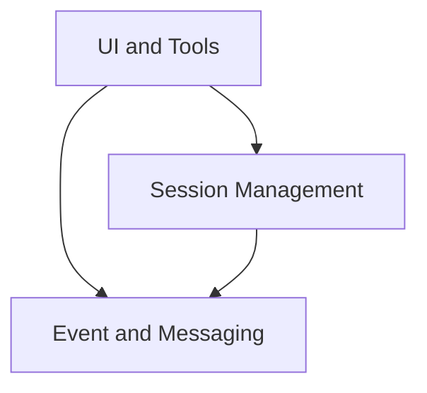

The `openai-realtime` repository provides a client-side application for real-time communication sessions with an AI model. It acts as a central orchestrator, managing the user interface, handling user interactions, controlling session lifecycles, and logging all communication events. The application is designed to facilitate interactive experiences with AI, integrating various UI components and specialized tools.

### Architecture Overview

The repository's core architecture is modular, separating concerns into distinct functional areas to enhance maintainability and scalability.

