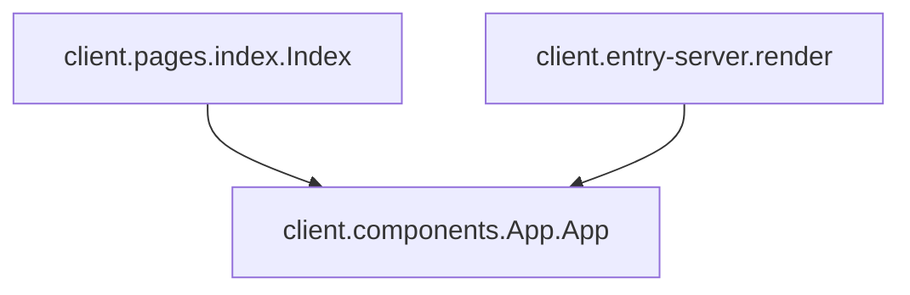

# Module: page_rendering

## Introduction

The `page_rendering` module is responsible for orchestrating the initial display of the application's main interface. It encompasses the core components that handle both client-side and server-side rendering of the application's root component, ensuring a consistent and performant user experience from the moment the application loads.

## Architecture and Component Relationships

The `page_rendering` module focuses on the initial presentation of the application. It acts as the direct entry point for rendering the main `App` component, which is the central hub for the application's overall structure and state.

<!-- DIAGRAM_JSON
{
    "direction": "TD",
    "nodes": [
        {"id": "index_page", "label": "client.pages.index.Index", "type": "component", "link": null},
        {"id": "server_render", "label": "client.entry-server.render", "type": "component", "link": null},
        {"id": "app_component", "label": "client.components.App.App", "type": "external", "link": "session_management.md"}
    ],
    "edges": [
        {"source": "index_page", "target": "app_component"},
        {"source": "server_render", "target": "app_component"}
    ],
    "groups": []
}
-->


### Core Components

#### `client.pages.index.Index`

This React functional component serves as the primary entry point for the client-side application's rendering. Its sole responsibility is to render the main `App` component. This ensures that when the client-side JavaScript loads, it immediately initializes and displays the entire application structure managed by `App`.

```javascript
function Index() {
  return <App />;
}
```

#### `client.entry-server.render`

This function is critical for Server-Side Rendering (SSR). It utilizes `react-dom/server`'s `renderToString` method to pre-render the `App` component into a static HTML string on the server. By wrapping `App` in `StrictMode`, it helps identify potential issues during development. This server-generated HTML is then sent to the client, allowing users to see content instantly while the client-side JavaScript loads and takes over, improving initial page load performance, user experience, and SEO.

```javascript
function render() {
  const html = renderToString(
    <StrictMode>
      <App />
    </StrictMode>,
  );
  return { html };
}
```

## How the Module Fits into the Overall System

The `page_rendering` module sits at the very foundation of the application's front-end. It defines how the application's root component, [client.components.App.App](session_management.md), is initially presented to the user.

*   **Initial Load**: When a user first navigates to the application, `client.entry-server.render` is invoked on the server to generate the initial HTML.
*   **Client-Side Hydration**: Once the client-side JavaScript loads, `client.pages.index.Index` takes over, "hydrating" the server-rendered HTML by attaching event listeners and making the application interactive.

This module ensures that the application has a robust and efficient mechanism for its initial display, bridging the gap between server-side pre-rendering and client-side interactivity. It is a foundational part of the `ui_and_tools` module, specifically within `core_ui_components`, as it manages the very first visual output.
