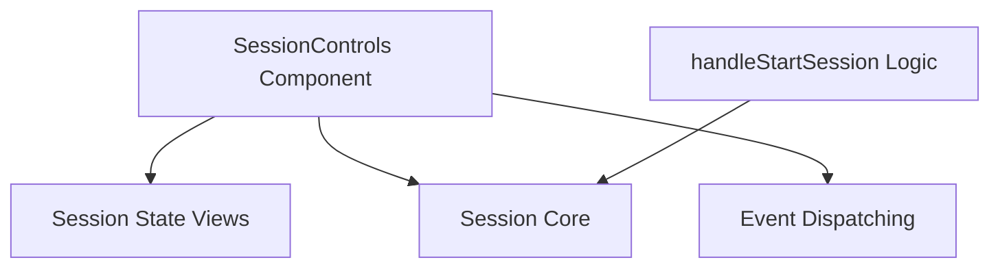

# Session Control Management

The `session_control_management` module is responsible for providing the user interface components and logic required to initiate and manage the lifecycle of a user session. It acts as the primary interface for users to start new sessions and interacts with underlying session management services to perform these operations.

## Architecture and Component Relationships

This module contains the core UI component for session controls and the associated logic for handling session initiation. It interacts with several other modules to fulfill its responsibilities, primarily for rendering session states and invoking session management actions.

<!-- DIAGRAM_JSON
{
    "direction": "TD",
    "nodes": [
        {"id": "session_controls_component", "label": "SessionControls Component", "type": "component", "link": null},
        {"id": "handle_start_session_logic", "label": "handleStartSession Logic", "type": "component", "link": null},
        {"id": "session_state_views", "label": "Session State Views", "type": "external", "link": "session_state_views.md"},
        {"id": "session_core", "label": "Session Core", "type": "external", "link": "session_core.md"},
        {"id": "event_dispatching", "label": "Event Dispatching", "type": "external", "link": "event_dispatching.md"}
    ],
    "edges": [
        {"source": "session_controls_component", "target": "session_state_views"},
        {"source": "session_controls_component", "target": "session_core"},
        {"source": "session_controls_component", "target": "event_dispatching"},
        {"source": "handle_start_session_logic", "target": "session_core"}
    ],
    "groups": []
}
-->


### Core Components

#### `SessionControls` Component (`client.components.SessionControls.SessionControls`)
The `SessionControls` component is the central UI element for managing sessions. It dynamically renders either a `SessionActive` view or a `SessionStopped` view based on the current session status (`isSessionActive` prop). This component receives various callback functions as props, including `startSession`, `stopSession`, `sendClientEvent`, and `sendTextMessage`, which it passes down to its child components or uses internally to interact with the broader application.

**Code Snippet:**
```javascript
function SessionControls({
  startSession,
  stopSession,
  sendClientEvent,
  sendTextMessage,
  serverEvents,
  isSessionActive,
}) {
  return (
    <div className="flex gap-4 border-t-2 border-gray-200 h-full rounded-md">
      {isSessionActive ? (
        <SessionActive
          stopSession={stopSession}
          sendClientEvent={sendClientEvent}
          sendTextMessage={sendTextMessage}
          serverEvents={serverEvents}
        />
      ) : (
        <SessionStopped startSession={startSession} />
      )}
    </div>
  );
}
```

#### `handleStartSession` Function (`client.components.SessionControls.handleStartSession`)
This function encapsulates the logic for initiating a session. It includes a safeguard to prevent multiple session activation attempts by checking an `isActivating` flag. Upon execution, it sets the `isActivating` flag to true and then invokes the `startSession` function, which is typically provided as a prop from a higher-level component responsible for core session management.

**Code Snippet:**
```javascript
function handleStartSession() {
    if (isActivating) return;

    setIsActivating(true);
    startSession();
  }
```

### Module Integration

The `session_control_management` module plays a crucial role in the overall system by providing the user's entry point for session interaction.

*   **UI Rendering**: It depends on the [session_state_views.md](session_state_views.md) module to display the appropriate UI (active or stopped) based on the session's current state.
*   **Session Lifecycle**: It relies on functions from the [session_core.md](session_core.md) module (e.g., `startSession`, `stopSession`) to perform the actual session management operations.
*   **Event Handling**: It can interact with the [event_dispatching.md](event_dispatching.md) module by forwarding `sendClientEvent` and `sendTextMessage` functions, enabling client-side event generation and message sending within an active session.
*   **Application Context**: The props like `startSession`, `stopSession`, `sendClientEvent`, and `sendTextMessage` are typically provided by the main application component, likely managed by the [application_session_integration.md](application_session_integration.md) module, which orchestrates these functions for the entire application.
