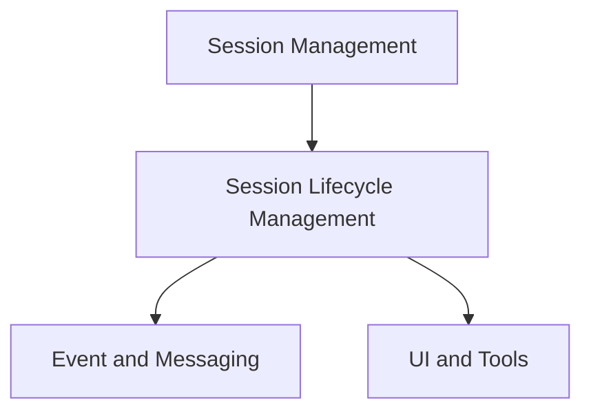

# Session Core Module Documentation

## Introduction
The `session_core` module is responsible for managing the fundamental lifecycle of a user session, particularly focusing on the establishment and termination of the WebRTC peer connection for real-time communication within the application. It encapsulates the core logic for starting and stopping a session, making it a critical component for interactive functionalities.

## Architecture Overview
The `session_core` module primarily contains the logic for session initiation and termination. It interacts closely with the broader [session_management.md](session_management.md) module, which oversees the overall session state and user interface controls. The core session events managed here also feed into the [event_and_messaging.md](event_and_messaging.md) module for communication and logging, and influence the rendering within the [ui_and_tools.md](ui_and_tools.md) module to reflect the current session status.

<!-- DIAGRAM_JSON
{
    "direction": "TD",
    "nodes": [
        {"id": "session_lifecycle", "label": "Session Lifecycle Management", "type": "module", "link": "session_lifecycle.md"},
        {"id": "session_management", "label": "Session Management (Parent)", "type": "external", "link": "session_management.md"},
        {"id": "event_and_messaging", "label": "Event and Messaging", "type": "external", "link": "event_and_messaging.md"},
        {"id": "ui_and_tools", "label": "UI and Tools", "type": "external", "link": "ui_and_tools.md"}
    ],
    "edges": [
        {"source": "session_management", "target": "session_lifecycle"},
        {"source": "session_lifecycle", "target": "event_and_messaging"},
        {"source": "session_lifecycle", "target": "ui_and_tools"}
    ],
    "groups": []
}
-->

### Sub-modules

- **[Session Lifecycle Management](session_lifecycle.md)**: This sub-module contains the core functions for initiating and terminating a session, managing the WebRTC peer connection and data channels.
