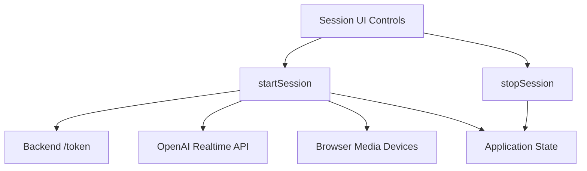

# `session_lifecycle` Module Documentation

## Introduction

The `session_lifecycle` module is responsible for managing the complete lifecycle of a real-time communication session with the OpenAI API. It handles the initiation (`startSession`) and termination (`stopSession`) of interactive sessions, which involve setting up WebRTC peer connections, managing audio streams, and establishing data channels for event exchange.

## Purpose and Core Functionality

This module provides the foundational mechanisms for establishing and dismantling the interactive AI experience. Its core functionalities include:

### `startSession`

This asynchronous function orchestrates the initiation of a new real-time session. It performs the following critical steps:

1.  **Token Acquisition**: Fetches an ephemeral session token from the backend `/token` endpoint to authenticate with the OpenAI Realtime API.
2.  **WebRTC Peer Connection Setup**: Creates an `RTCPeerConnection` instance, which is the core of the real-time communication.
3.  **Audio Handling**: Configures an `<audio>` element to play remote audio received from the model and adds a local audio track from the user's microphone for input.
4.  **Data Channel Establishment**: Creates a data channel (`oai-events`) over the peer connection for sending and receiving arbitrary data and events.
5.  **Session Description Protocol (SDP) Negotiation**: Generates an SDP offer, sets it as the local description, and sends it to the OpenAI Realtime API. It then receives and sets the remote SDP answer to complete the connection.

### `stopSession`

This function is responsible for gracefully terminating an active real-time session. It ensures that all resources are properly released:

1.  **Data Channel Closure**: Closes the established data channel, preventing further data exchange.
2.  **Media Track Stoppage**: Iterates through all media senders in the peer connection and stops their associated tracks (e.g., microphone input), releasing hardware resources.
3.  **Peer Connection Closure**: Closes the WebRTC peer connection, tearing down the network connection.
4.  **State Reset**: Resets internal state variables (`isSessionActive`, `dataChannel`, `peerConnection.current`) to their initial states, indicating that no session is active.

## Architecture and Component Relationships

The `session_lifecycle` module is a leaf module within the `session_core` component, itself part of the broader `session_management` module. It encapsulates the direct interactions required to establish and tear down WebRTC connections.

*   **Dependencies**: It relies on browser's WebRTC APIs (`RTCPeerConnection`, `navigator.mediaDevices`), a backend service for token generation, and the OpenAI Realtime API.
*   **Integration**: It updates application-wide session state, managed by the `application_session_integration` module ([application_session_integration.md](application_session_integration.md)), and its functions are typically triggered by user interactions facilitated by the `session_ui_controls` module ([session_ui_controls.md](session_ui_controls.md)). Events sent and received during an active session are processed by the `event_and_messaging` module ([event_and_messaging.md](event_and_messaging.md)).

<!-- DIAGRAM_JSON
{
    "direction": "TD",
    "nodes": [
        {"id": "start_session", "label": "startSession", "type": "component", "link": null},
        {"id": "stop_session", "label": "stopSession", "type": "component", "link": null},
        {"id": "token_endpoint", "label": "Backend /token", "type": "external", "link": null},
        {"id": "openai_api", "label": "OpenAI Realtime API", "type": "external", "link": null},
        {"id": "browser_media", "label": "Browser Media Devices", "type": "external", "link": null},
        {"id": "app_state", "label": "Application State", "type": "external", "link": "application_session_integration.md"},
        {"id": "session_controls", "label": "Session UI Controls", "type": "external", "link": "session_ui_controls.md"}
    ],
    "edges": [
        {"source": "start_session", "target": "token_endpoint"},
        {"source": "start_session", "target": "openai_api"},
        {"source": "start_session", "target": "browser_media"},
        {"source": "start_session", "target": "app_state"},
        {"source": "stop_session", "target": "app_state"},
        {"source": "session_controls", "target": "start_session"},
        {"source": "session_controls", "target": "stop_session"}
    ],
    "groups": []
}
-->

