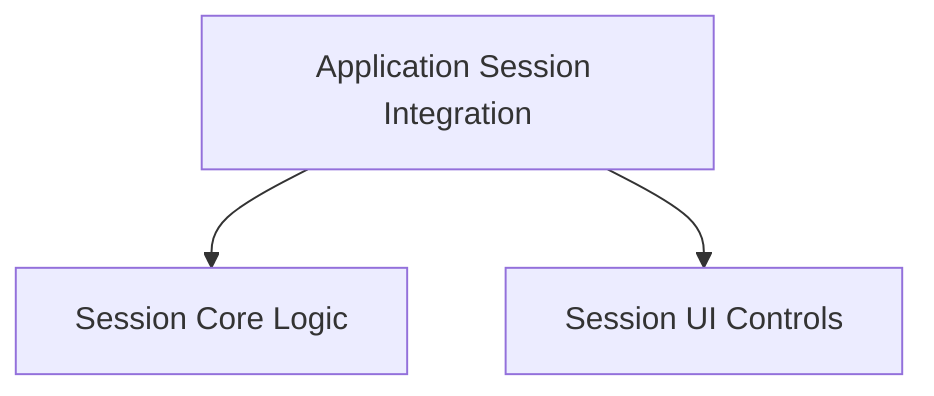

# Session Management Module

The `session_management` module is responsible for orchestrating the lifecycle of communication sessions within the application. It handles the initiation, active management, and termination of real-time sessions, primarily utilizing WebRTC for audio and data exchange.

## Architecture Overview

This module is structured into three main sub-modules, each focusing on a specific aspect of session management:

1.  **Application Session Integration** (`application_session_integration.md`): The central component that integrates session logic into the overall application flow.
2.  **Session Core Logic** (`session_core.md`): Contains the fundamental functions for establishing and dismantling WebRTC connections.
3.  **Session UI Controls** (`session_ui_controls.md`): Manages the user interface elements that allow users to interact with session states.

<!-- DIAGRAM_JSON
{
    "direction": "TD",
    "nodes": [
        {"id": "application_session_integration", "label": "Application Session Integration", "type": "module", "link": "application_session_integration.md"},
        {"id": "session_core", "label": "Session Core Logic", "type": "module", "link": "session_core.md"},
        {"id": "session_ui_controls", "label": "Session UI Controls", "type": "module", "link": "session_ui_controls.md"}
    ],
    "edges": [
        {"source": "application_session_integration", "target": "session_core"},
        {"source": "application_session_integration", "target": "session_ui_controls"}
    ],
    "groups": []
}
-->

## Sub-modules

### Application Session Integration

The `application_session_integration` sub-module, primarily represented by the `App` component, is the central hub for session management. It maintains the global state of the session (e.g., `isSessionActive`, `dataChannel`, `peerConnection`) and exposes the core `startSession` and `stopSession` functions to other parts of the application. It also integrates event handling for the data channel, ensuring that incoming messages are processed and the UI is updated accordingly.

### Session Core Logic

The `session_core` sub-module encapsulates the essential functionalities for establishing and terminating a WebRTC session. It includes `startSession`, which handles the negotiation with the OpenAI Realtime API to obtain a session token, set up the peer connection, configure audio input/output, and create the data channel. The `stopSession` function is responsible for gracefully closing the data channel, stopping media tracks, and closing the peer connection, effectively ending the communication session.

### Session UI Controls

The `session_ui_controls` sub-module is dedicated to providing the user interface for managing sessions. It comprises components like `SessionControls`, `SessionStopped`, and `SessionActive`. `SessionControls` acts as a smart component, rendering either `SessionStopped` (with a "start session" button) or `SessionActive` (with a text input for messages and a "disconnect" button) based on the current session status. This ensures a responsive and intuitive user experience for controlling the session lifecycle.