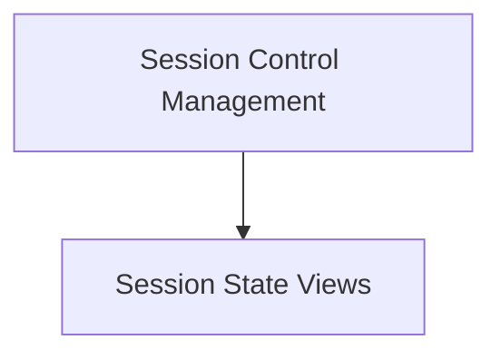

# Session UI Controls Module

## Introduction
The `session_ui_controls` module is responsible for managing and displaying the user interface elements related to starting, stopping, and interacting with user sessions. It provides the core UI components that allow users to control their session's lifecycle and send messages to the active session.

## Architecture Overview
The module is structured into two main sub-modules: `session_control_management` and `session_state_views`. The `session_control_management` acts as the orchestrator, determining which session state view to display based on the current session status. The `session_state_views` sub-module contains the specific UI components for active and stopped sessions.

<!-- DIAGRAM_JSON
{
    "direction": "TD",
    "nodes": [
        {"id": "session_control_management", "label": "Session Control Management", "type": "module", "link": "session_control_management.md"},
        {"id": "session_state_views", "label": "Session State Views", "type": "module", "link": "session_state_views.md"}
    ],
    "edges": [
        {"source": "session_control_management", "target": "session_state_views"}
    ],
    "groups": []
}
-->

## Sub-modules

### [Session Control Management](session_control_management.md)
This sub-module contains the primary `SessionControls` component, which intelligently renders either the `SessionActive` or `SessionStopped` view based on the session's current status. It also includes `handleStartSession`, a key function for initiating a new session.

### [Session State Views](session_state_views.md)
This sub-module provides the distinct user interfaces for active and stopped sessions. `SessionStopped` allows users to start a new session, while `SessionActive` enables users to send text messages and disconnect from an ongoing session.
