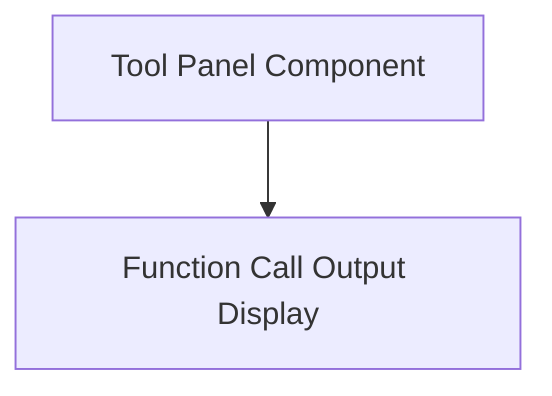

# Tool Panel Module

## Introduction
The `tool_panel` module provides the user interface and core logic for interacting with a specific tool within the application, currently demonstrated by a "Color Palette Tool". It handles the display of tool-specific information and the visualization of function call outputs, integrating with the broader session and event management system.

## Architecture Overview
The `tool_panel` module is composed of two main sub-modules:
*   `tool_panel_component`: The primary component that orchestrates the tool's behavior and state.
*   `function_call_output_display`: A presentation component responsible for rendering the visual results of tool function calls.

These components work together to provide an interactive and responsive tool experience.

## Sub-modules

*   **[Tool Panel Component](tool_panel_component.md)**: This sub-module contains the main `ToolPanel` component, which is responsible for managing the state of the tool, handling incoming session events, and triggering client events based on user interactions or session status. It determines what content is displayed within the tool panel, such as instructions or the output of a function call.

*   **[Function Call Output Display](function_call_output_display.md)**: This sub-module includes the `FunctionCallOutput` component, which is dedicated to parsing and visually rendering the data returned from specific function calls. In the current context, it's used to display a generated color palette and its associated theme.

<!-- DIAGRAM_JSON
{
    "direction": "TD",
    "nodes": [
        {"id": "tool_panel_component", "label": "Tool Panel Component", "type": "module", "link": "tool_panel_component.md"},
        {"id": "function_call_output_display", "label": "Function Call Output Display", "type": "module", "link": "function_call_output_display.md"}
    ],
    "edges": [
        {"source": "tool_panel_component", "target": "function_call_output_display"}
    ],
    "groups": []
}
-->

