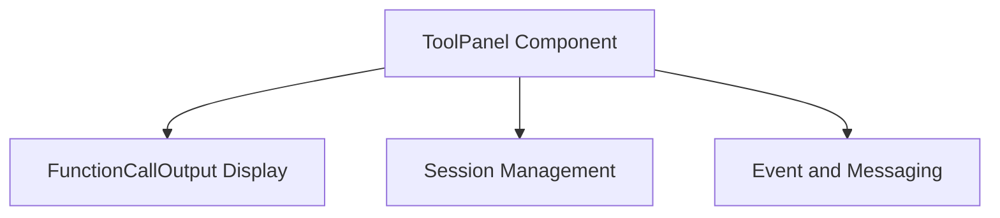

# `tool_panel_component` Module Documentation

The `tool_panel_component` module encapsulates the `ToolPanel` React component, which provides a dedicated UI for interacting with specific tools within the application, such as the "Color Palette Tool". It manages the state and logic for displaying tool-specific information and handling user interactions related to these tools.

## Purpose and Core Functionality

-   **Tool Display**: Renders a dedicated panel for displaying interactive tools.
-   **Session State Integration**: Reacts to the overall session activity (`isSessionActive`) to enable or disable tool functionality.
-   **Event Handling**: Monitors incoming events to trigger tool-specific actions, such as initializing tool functions or processing function call outputs.
-   **Function Call Output Visualization**: Dynamically renders the `FunctionCallOutput` component to display results from executed functions, like a color palette.
-   **Client Event Dispatch**: Sends client events back to the session, for instance, to request feedback after a tool action.

## Architecture and Component Relationships

<!-- DIAGRAM_JSON
{
    "direction": "TD",
    "nodes": [
        {"id": "tool_panel_component", "label": "ToolPanel Component", "type": "component", "link": null},
        {"id": "function_call_output_display", "label": "FunctionCallOutput Display", "type": "external", "link": "function_call_output_display.md"},
        {"id": "session_management", "label": "Session Management", "type": "external", "link": "session_management.md"},
        {"id": "event_and_messaging", "label": "Event and Messaging", "type": "external", "link": "event_and_messaging.md"}
    ],
    "edges": [
        {"source": "tool_panel_component", "target": "function_call_output_display"},
        {"source": "tool_panel_component", "target": "session_management"},
        {"source": "tool_panel_component", "target": "event_and_messaging"}
    ],
    "groups": []
}
-->

## How the Module Fits into the Overall System

The `tool_panel_component` module is a crucial part of the user interface, specifically within the `ui_and_tools` module structure. It acts as a container and orchestrator for specific interactive tools, enhancing the user experience by providing dynamic feedback and interaction points. It relies on the [session_management](session_management.md) module to understand the current session state and interacts heavily with the [event_and_messaging](event_and_messaging.md) module to send and receive application events. When a tool produces an output, it leverages the [function_call_output_display](function_call_output_display.md) module to render the results effectively. This integration allows for a modular and responsive tool ecosystem within the application.