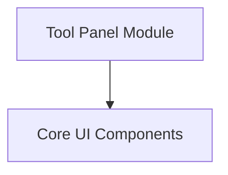

# UI and Tools Module

## Introduction

The `ui_and_tools` module is responsible for rendering the user interface components and integrating interactive tools within the application. It provides the foundational UI elements, manages the display of specific tools like the Color Palette Tool, and handles the overall client-side rendering process.

## Architecture

The `ui_and_tools` module is composed of core UI components and a dedicated tool panel module. It serves as the primary interface layer for user interaction.

<!-- DIAGRAM_JSON
{
    "direction": "TD",
    "nodes": [
        {"id": "core_ui_components", "label": "Core UI Components", "type": "module", "link": "core_ui_components.md"},
        {"id": "tool_panel", "label": "Tool Panel Module", "type": "module", "link": "tool_panel.md"}
    ],
    "edges": [
        {"source": "tool_panel", "target": "core_ui_components"}
    ],
    "groups": []
}
-->

## Sub-modules

### [Core UI Components](core_ui_components.md)
This sub-module encapsulates fundamental user interface elements and the primary entry points for both client-side and server-side rendering. It includes generic components like buttons and the main application container.

### [Tool Panel Module](tool_panel.md)
This sub-module manages the display and interactive logic for specific application tools, such as the Color Palette Tool. It handles tool-related events, displays tool outputs, and integrates with the overall session management to provide dynamic tool functionality.
