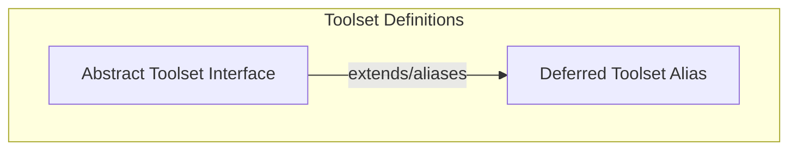

# Abstract and Deferred Toolsets

This module defines the foundational interfaces for toolsets within the Pydantic AI framework, enabling structured interaction with various tools and functionalities. It provides an abstract base for all toolset implementations and handles the concept of deferred loading for external toolsets.

## Architecture Overview

The `abstract_and_deferred_toolsets` module establishes the core contract for how toolsets are defined and interact within the system. The `AbstractToolset` serves as the blueprint, ensuring all concrete toolsets adhere to a common interface for listing, validating, and calling tools. The `DeferredToolset` component acts as a bridge for integrating external tools, particularly those that may be loaded on demand.

These components are crucial for maintaining a flexible and extensible tool ecosystem, allowing agents to seamlessly discover and utilize a wide range of capabilities, from built-in functionalities to external integrations.

<!-- DIAGRAM_JSON
{
    "direction": "TD",
    "nodes": [
        {"id": "abstract_toolset_interface", "label": "Abstract Toolset Interface", "type": "module", "link": "abstract_toolset_interface.md"},
        {"id": "deferred_toolset_alias", "label": "Deferred Toolset Alias", "type": "module", "link": "deferred_toolset_alias.md"}
    ],
    "edges": [
        {"source": "abstract_toolset_interface", "target": "deferred_toolset_alias", "label": "extends/aliases"}
    ],
    "groups": [
        {
            "id": "toolset_definitions",
            "label": "Toolset Definitions",
            "role": "analytical",
            "nodes": ["abstract_toolset_interface", "deferred_toolset_alias"]
        }
    ]
}
-->

## Sub-modules

*   ### [Abstract Toolset Interface](abstract_toolset_interface.md)
    This sub-module defines the abstract interface for all toolsets, outlining methods for tool management and lifecycle. It provides the fundamental contract that all concrete toolset implementations must adhere to, ensuring consistency and extensibility within the Pydantic AI framework.

*   ### [Deferred Toolset Alias](deferred_toolset_alias.md)
    This sub-module provides a deprecated alias for the ExternalToolset, indicating a mechanism for external tool integration. It is primarily used for backward compatibility and points to the `ExternalToolset` for actual external tool handling logic. This allows for flexible loading and integration of tools that might not be immediately available or need dynamic resolution.

