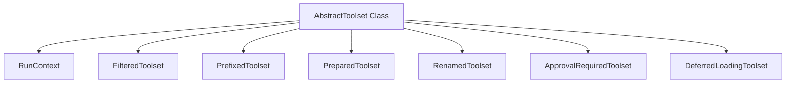

# `abstract_toolset`

## Introduction
The `abstract_toolset` module, part of the `pydantic_ai.toolsets` package, defines the foundational `AbstractToolset` class. This abstract base class serves as the blueprint for all toolsets within the `pydantic_ai` framework, establishing a standardized interface for agents to discover, validate, and execute tools. It ensures consistency in how tools are managed and interacted with across different agent implementations.

## Core Functionality

The `AbstractToolset` class provides the essential contract for any toolset. Its core responsibilities include:

*   **Tool Listing**: Providing a mechanism to enumerate the tools it contains.
*   **Argument Validation**: Ensuring that the arguments passed to tools conform to their expected schemas.
*   **Tool Execution**: Defining the method through which tools are invoked.
*   **Lifecycle Management**: Offering asynchronous context management (`__aenter__` and `__aexit__`) for resource setup and teardown.
*   **Run-specific and Step-specific Instantiation**: Allowing toolsets to provide different instances for each agent run or even each step within a run, facilitating state isolation.
*   **Instruction Provision**: Enabling toolsets to offer instructions to the agent on how to effectively utilize its tools.

Beyond these core functionalities, `AbstractToolset` also provides a rich set of decorator methods that allow for the creation of new toolsets with modified behaviors, such as filtering, prefixing, renaming, preparing, requiring approval, or deferring tool loading.

## Architecture and Component Relationships

The `AbstractToolset` is the base of a hierarchy of toolset abstractions. It defines the abstract methods that concrete toolset implementations must provide, ensuring a consistent interface for the agent.

<!-- DIAGRAM_JSON
{
    "direction": "TD",
    "nodes": [
        {"id": "abstract_toolset_class", "label": "AbstractToolset Class", "type": "component", "link": null},
        {"id": "run_context", "label": "RunContext", "type": "external", "link": "pydantic_ai_core.md"},
        {"id": "filtered_toolset", "label": "FilteredToolset", "type": "external", "link": "filtered_toolset.md"},
        {"id": "prefixed_toolset", "label": "PrefixedToolset", "type": "external", "link": "prefixed_toolset.md"},
        {"id": "prepared_toolset", "label": "PreparedToolset", "type": "external", "link": "prepared_toolset.md"},
        {"id": "renamed_toolset", "label": "RenamedToolset", "type": "external", "link": "renamed_toolset.md"},
        {"id": "approval_required_toolset", "label": "ApprovalRequiredToolset", "type": "external", "link": "approval_required_toolset.md"},
        {"id": "deferred_loading_toolset", "label": "DeferredLoadingToolset", "type": "external", "link": "deferred_loading_toolset.md"}
    ],
    "edges": [
        {"source": "abstract_toolset_class", "target": "run_context"},
        {"source": "abstract_toolset_class", "target": "filtered_toolset"},
        {"source": "abstract_toolset_class", "target": "prefixed_toolset"},
        {"source": "abstract_toolset_class", "target": "prepared_toolset"},
        {"source": "abstract_toolset_class", "target": "renamed_toolset"},
        {"source": "abstract_toolset_class", "target": "approval_required_toolset"},
        {"source": "abstract_toolset_class", "target": "deferred_loading_toolset"}
    ],
    "groups": []
}
-->

### `AbstractToolset` Class
The `AbstractToolset` class (`pydantic_ai_slim.pydantic_ai.toolsets.abstract.AbstractToolset`) defines the following key abstract properties and methods:

*   **`id`**: A unique identifier for the toolset, crucial for durable execution environments.
*   **`label`**: A human-readable name for the toolset, used primarily in error messages.
*   **`tool_name_conflict_hint`**: Provides guidance on resolving tool name conflicts.
*   **`for_run(ctx)`**: Returns the toolset instance to be used for a specific agent run, enabling per-run state isolation.
*   **`for_run_step(ctx)`**: Returns the toolset instance for a particular step within an agent run, allowing for per-step state transitions.
*   **`__aenter__` and `__aexit__`**: Asynchronous context manager methods for managing resource lifecycle.
*   **`get_instructions(ctx)`**: Provides instructions to the agent on how to use the toolset's tools.
*   **`get_tools(ctx)`**: An abstract method that must be implemented by concrete toolsets to return a dictionary of available tools.
*   **`call_tool(name, tool_args, ctx, tool)`**: An abstract method for executing a specified tool with given arguments.

### Derivative Toolsets

The `AbstractToolset` also includes methods that return instances of other toolset types, demonstrating how different behaviors can be composed:

*   **`filtered(filter_func)`**: Returns a [`FilteredToolset`][filtered_toolset.md] that selectively exposes tools based on a provided filter function.
*   **`prefixed(prefix)`**: Returns a [`PrefixedToolset`][prefixed_toolset.md] that adds a specified prefix to all tool names, useful for avoiding naming conflicts.
*   **`prepared(prepare_func)`**: Returns a [`PreparedToolset`][prepared_toolset.md] that applies a preparation function to tool definitions before they are exposed.
*   **`renamed(name_map)`**: Returns a [`RenamedToolset`][renamed_toolset.md] that renames tools based on a provided mapping.
*   **`approval_required(approval_required_func)`**: Returns an [`ApprovalRequiredToolset`][approval_required_toolset.md] that intercepts tool calls and optionally requires explicit approval before execution.
*   **`defer_loading(tool_names)`**: Returns a [`DeferredLoadingToolset`][deferred_loading_toolset.md] that hides tools until they are discovered through a tool search mechanism.

These methods highlight the extensible nature of the toolset architecture, allowing developers to easily modify and combine toolset behaviors.

## Integration with the Overall System

The `abstract_toolset` module is a fundamental building block in the `pydantic_ai` framework, particularly within the [pydantic_ai_tools](pydantic_ai_tools.md) and [pydantic_ai_agent_core](pydantic_ai_agent_core.md) modules. It defines the contract that enables agents to interact with various capabilities, whether they are built-in functionalities or external integrations. By providing a consistent interface, `AbstractToolset` ensures that:

*   **Agent Flexibility**: Agents can seamlessly integrate and utilize any toolset that adheres to this abstract definition, regardless of its underlying implementation.
*   **Modularity**: Toolsets can be developed and managed independently, promoting a modular and maintainable system.
*   **Extensibility**: New types of toolsets with specialized behaviors can be easily introduced by extending `AbstractToolset` or by using its decorator methods.

The `RunContext` (likely defined in [pydantic_ai_core](pydantic_ai_core.md)) plays a crucial role in `AbstractToolset` methods, providing agents with necessary runtime information and dependencies, thus tightly integrating tool execution within the agent's operational environment.
