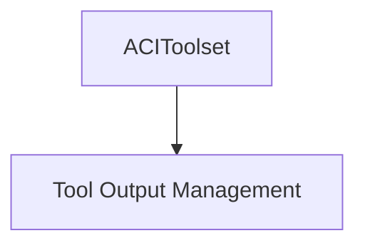

# aci_integration

The `aci_integration` module provides a specialized toolset for integrating with ACI.dev tools, enabling the AI agent to interact with external ACI functions.

## Architecture and Component Relationships

This module's primary component is `ACIToolset`, which acts as a wrapper for various ACI functions. It leverages the core `FunctionToolset` from the `tool_output_management` module to build a collection of ACI-specific tools.

<!-- DIAGRAM_JSON
{
    "direction": "TD",
    "nodes": [
        {"id": "aci_toolset", "label": "ACIToolset", "type": "component", "link": null},
        {"id": "tool_output_management", "label": "Tool Output Management", "type": "external", "link": "tool_output_management.md"}
    ],
    "edges": [
        {"source": "aci_toolset", "target": "tool_output_management"}
    ],
    "groups": []
}
-->

### `ACIToolset`

The `ACIToolset` class extends `FunctionToolset` and is responsible for wrapping ACI.dev functions into a usable format for the AI agent.

- **`__init__(self, aci_functions: Sequence[str], linked_account_owner_id: str, *, id: str | None = None)`**:
    - Initializes the `ACIToolset` by converting a sequence of ACI function names into tool objects.
    - `aci_functions`: A list of strings, where each string is the name of an ACI.dev function to be wrapped.
    - `linked_account_owner_id`: An identifier for the owner of the linked account, used in the conversion of ACI functions to tools.
    - `id`: An optional identifier for the toolset.

## How it Fits into the Overall System

The `aci_integration` module is a sub-module of `third_party_toolsets` within the broader `pydantic_ai_tools` ecosystem. It allows the AI agent to extend its capabilities by interacting with ACI.dev services. By providing a structured way to integrate external ACI functions, it enhances the agent's ability to perform tasks that require specific ACI functionalities. Its reliance on `tool_output_management` ensures that ACI tools adhere to the system's standard for function toolsets.

This module plays a crucial role in enabling the AI agent to:
- Dynamically incorporate ACI.dev functions as callable tools.
- Maintain a consistent interface for interacting with diverse external services through the `FunctionToolset` abstraction.
