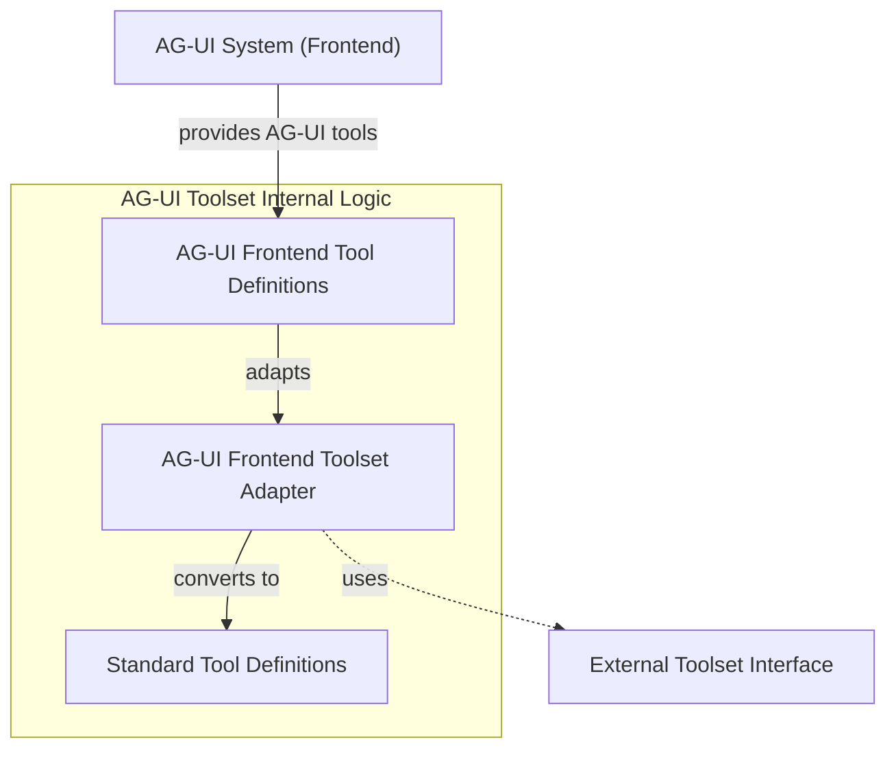

# ag_ui_toolset Module Documentation

The `ag_ui_toolset` module is a critical component for integrating the Agent UI (AG-UI) frontend with the backend agent's tool management system. It acts as an adapter, translating AG-UI specific tool definitions into a standardized format that can be consumed by the agent's core tool processing logic. This module ensures seamless communication and functionality between the interactive frontend and the robust backend agent capabilities.

### Module Overview

This module is responsible for bridging the gap between the AG-UI's way of defining tools and the internal `pydantic_ai` framework's `ToolDefinition` structure. By providing the `_AGUIFrontendToolset` class, it enables the system to register and utilize tools originating from the AG-UI frontend as if they were any other external toolset. This abstraction simplifies the development of AG-UI-driven applications, allowing frontend developers to define tools using a native AG-UI structure while the backend handles the complexities of execution and management.

<!-- DIAGRAM_JSON
{
    "direction": "TD",
    "nodes": [
        {"id": "ag_ui_toolset_adapter", "label": "AG-UI Frontend Toolset Adapter", "type": "component", "link": null},
        {"id": "ag_ui_frontend_tool_definitions", "label": "AG-UI Frontend Tool Definitions", "type": "component", "link": null},
        {"id": "standard_tool_definitions", "label": "Standard Tool Definitions", "type": "component", "link": null},
        {"id": "external_toolset_interface", "label": "External Toolset Interface", "type": "external", "link": "toolset_management.md"},
        {"id": "ag_ui_system", "label": "AG-UI System (Frontend)", "type": "external", "link": "ui_core.md"}
    ],
    "edges": [
        {"source": "ag_ui_system", "target": "ag_ui_frontend_tool_definitions", "label": "provides AG-UI tools"},
        {"source": "ag_ui_frontend_tool_definitions", "target": "ag_ui_toolset_adapter", "label": "adapts"},
        {"source": "ag_ui_toolset_adapter", "target": "standard_tool_definitions", "label": "converts to"},
        {"source": "ag_ui_toolset_adapter", "target": "external_toolset_interface", "label": "uses"}
    ],
    "groups": [
        {
            "id": "ag_ui_toolset_internal",
            "label": "AG-UI Toolset Internal Logic",
            "role": "data_processing",
            "nodes": ["ag_ui_toolset_adapter", "ag_ui_frontend_tool_definitions", "standard_tool_definitions"]
        }
    ]
}
-->
```


### Components

#### _AGUIFrontendToolset

The `_AGUIFrontendToolset` class is the core component of this module. It is a specialized implementation of an `ExternalToolset` ([toolset_management.md](toolset_management.md)), designed to manage tools specifically defined for the AG-UI frontend.

**Functionality:**

*   **Adaptation**: Upon initialization, it takes a list of `AGUITool` objects (representing tool definitions from the AG-UI frontend) and translates each one into a `ToolDefinition` object. This conversion involves mapping the AG-UI tool's name, description, and parameter schema to the standardized `ToolDefinition` format.
*   **Integration with Tool Management**: By extending `ExternalToolset`, `_AGUIFrontendToolset` integrates seamlessly into the broader tool management system. The converted `ToolDefinition` objects are then available for the agent to discover, validate, and execute.
*   **Labeling**: Provides a descriptive label, "the AG-UI frontend tools," for identification within the system.

This adaptation layer is crucial because it allows the AG-UI system ([ui_core.md](ui_core.md)) to define and expose its tools using its own internal representations, while the `pydantic_ai` agent can interact with them through a consistent, unified interface. This promotes modularity and reduces coupling between the frontend and backend components.