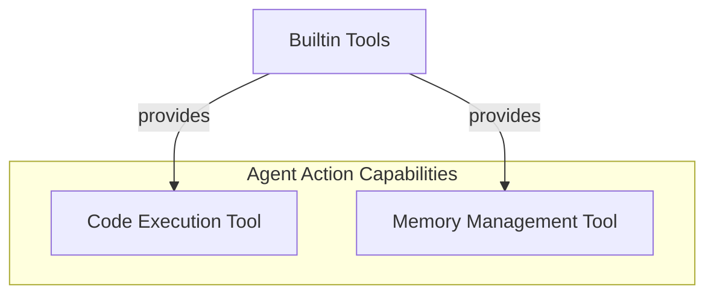

# Agent Action Tools Module

## Introduction

The `agent_action_tools` module provides essential built-in functionalities that enable agents to perform dynamic actions within their environment. These tools are critical for agents requiring capabilities such as executing code or managing internal memory to enhance their decision-making and task completion.

## Architecture Overview

This module integrates directly with the agent's core capabilities, offering specialized tools that can be invoked during an agent's operation. It focuses on providing a robust and extensible framework for defining and utilizing agent actions, forming a vital part of the overall agent ecosystem.

<!-- DIAGRAM_JSON
{
    "direction": "TD",
    "nodes": [
        {"id": "code_execution_tool", "label": "Code Execution Tool", "type": "module", "link": "code_execution_tool.md"},
        {"id": "memory_management_tool", "label": "Memory Management Tool", "type": "module", "link": "memory_management_tool.md"},
        {"id": "builtin_tools", "label": "Builtin Tools", "type": "external", "link": "builtin_tools.md"}
    ],
    "edges": [
        {"source": "builtin_tools", "target": "code_execution_tool", "label": "provides"},
        {"source": "builtin_tools", "target": "memory_management_tool", "label": "provides"}
    ],
    "groups": [
        {
            "id": "agent_action_capabilities",
            "label": "Agent Action Capabilities",
            "role": "generative",
            "nodes": ["code_execution_tool", "memory_management_tool"]
        }
    ]
}
-->

## Sub-modules

### [Code Execution Tool](code_execution_tool.md)

This sub-module encapsulates the functionality for agents to execute arbitrary code. It provides a sandboxed environment, allowing agents to test hypotheses, process data, or interact with external systems programmatically.

### [Memory Management Tool](memory_management_tool.md)

The Memory Management Tool enables agents to store and retrieve information, providing a mechanism for short-term and long-term memory. This is crucial for maintaining context, learning from past interactions, and enhancing the agent's ability to engage in complex, multi-turn conversations or tasks.
