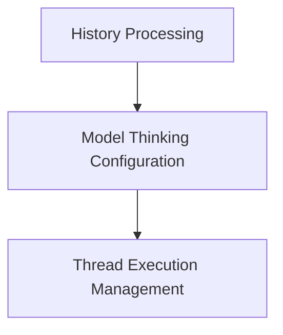

# Agent Behaviors Module

The `agent_behaviors` module within `pydantic_ai_capabilities` defines core behaviors and capabilities that can be integrated into AI agents. These behaviors enhance an agent's ability to process information, reason, and manage asynchronous operations efficiently. It provides capabilities such as pre-processing message history, configuring the agent's thinking process, and managing thread execution for synchronous tasks.

## Architecture

The `agent_behaviors` module is composed of several key sub-modules, each handling a specific aspect of an agent's operational behavior:

<!-- DIAGRAM_JSON
{
    "direction": "TD",
    "nodes": [
        {"id": "history_processing", "label": "History Processing", "type": "module", "link": "history_processing.md"},
        {"id": "model_thinking", "label": "Model Thinking Configuration", "type": "module", "link": "model_thinking.md"},
        {"id": "thread_execution_management", "label": "Thread Execution Management", "type": "module", "link": "thread_execution_management.md"}
    ],
    "edges": [
        {"source": "history_processing", "target": "model_thinking"},
        {"source": "model_thinking", "target": "thread_execution_management"}
    ],
    "groups": []
}
-->

## Sub-modules

### [History Processing](history_processing.md)
This sub-module is responsible for processing message history before it is sent to the model for requests, allowing for modifications or filtering of past interactions.

### [Model Thinking Configuration](model_thinking.md)
This sub-module enables and configures the model's thinking and reasoning capabilities, providing options to control the effort level of thought processes.

### [Thread Execution Management](thread_execution_management.md)
This sub-module provides a mechanism to use custom thread executors for running synchronous functions, which is crucial for managing concurrency and resource utilization in long-running applications.